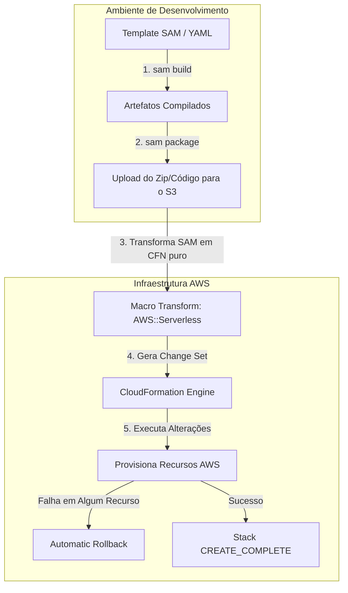
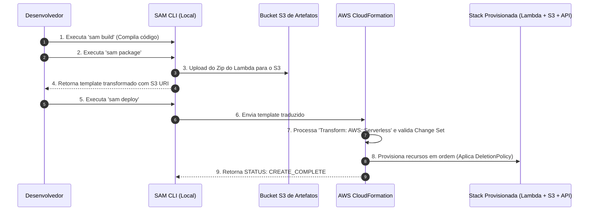

# AWS CloudFormation & AWS SAM (Infrastructure as Code)

## O que é

O **AWS CloudFormation** é o serviço nativo e definitivo de Infraestrutura como Código (*Infrastructure as Code - IaC*) da AWS. Ele permite declarar, provisionar, atualizar e gerenciar de forma automatizada e repetível toda a sua infraestrutura AWS por meio de arquivos de modelo (*templates*) em formato JSON ou YAML.

O **AWS Serverless Application Model (SAM)** é um framework *open-source* construído **sobre o CloudFormation**, projetado especificamente para simplificar a criação de aplicações serverless. O SAM introduz uma sintaxe simplificada e concisa para definir recursos comuns de arquiteturas sem servidor (como funções Lambda, APIs do API Gateway, tabelas DynamoDB e eventos de acionamento) e inclui uma ferramenta de linha de comando CLI poderosa para build, testes locais, empacotamento e deploy.

Para um desenvolvedor ou arquiteto:

> **O CloudFormation é o motor genérico de provisionamento de qualquer recurso AWS. O SAM é uma abstração de atalho (açúcar sintático) focada em Serverless que é traduzida para CloudFormation puro antes do deploy.**

---

## Qual problema resolve

### 1. Criar Infraestrutura Manualmente via Console (*ClickOps*)

Provisionar ambientes clicando no console AWS gera inconsistências, erros humanos, falta de rastreabilidade e impossibilita a reprodução exata de ambientes (Dev, Staging, Prod). O CloudFormation resolve garantindo que a infraestrutura seja declarativa, versionável no Git e auditável.

### 2. Dificuldade de Limpeza e "Orphan Resources"

Quando você cria manualmente dezenas de recursos (VPC, Subnets, EC2, IAM Roles, Security Groups, RDS), deletá-los sem deixar nada para trás é um pesadelo e pode gerar custos indesejados. Com o CloudFormation, deletar a **Stack** remove automaticamente **todos** os recursos criados por ela na ordem de dependência correta.

### 3. Verbosidade Extrema ao Declarar Serverless

Declarar uma única função Lambda acionada por uma API REST no API Gateway com roles IAM em CloudFormation puro pode exigir mais de 100 linhas de YAML/JSON complexo. O AWS SAM resolve reduzindo essa mesma declaração para cerca de 20 linhas simples usando o tipo especial `AWS::Serverless::Function`.

---

## Quando utilizar

### Quando usar o AWS CloudFormation:

* **Automação de Infraestrutura Geral:** Provisionar VPCs, subnets, gateways de rede, clusters EKS, bancos de dados RDS, instâncias EC2 e políticas IAM de forma padronizada.
* **Orquestração Multi-Conta/Multi-Região:** Usar **StackSets** para implantar automaticamente baselines de segurança, roles de governança ou logs em centenas de contas AWS de uma Organização.
* **Governança e Drift Detection:** Monitorar se alterações manuais foram feitas na infraestrutura e discrepam do modelo original (*Drift*).

### Quando usar o AWS SAM:

* **Desenvolvimento de Aplicações Serverless:** Construir e implantar microsserviços baseados em Lambda, API Gateway, DynamoDB e EventBridge.
* **Testes e Execução Local:** Testar invocações do Lambda ou executar uma API HTTP/REST localmente no seu computador emulando o ambiente AWS via Docker (`sam local start-api` / `sam local invoke`).
* **Pipelines de CI/CD para Serverless:** Utilizar `sam package` e `sam deploy` para construir e promover artefatos através de ambientes de homologação e produção.

---

## Quando NÃO utilizar

* **Projetos Avançados de Desenvolvimento Orientados a Objetos (Code-First IaC):** Se a sua equipe prefere declarar infraestrutura usando linguagens de programação reais (TypeScript, Python, Java, Go) para reaproveitar estruturas de dados, loops e abstrações orientadas a objetos. *Alternativa:* **AWS CDK (Cloud Development Kit)** — *que por baixo dos panos também sintetiza templates do CloudFormation*.
* **Gerenciamento de Ambientes Multi-Cloud com o Mesmo Workflow:** Se você precisa provisionar infraestrutura na AWS, GCP, Azure e SaaS de terceiros usando exatamente o mesmo motor declarativo. *Alternativa:* **HashiCorp Terraform** ou **Pulumi**.
* **Gerenciamento de Estado Dinâmico Extremamente Frequente de Aplicações Web:** O CloudFormation é focado em infraestrutura, não no gerenciamento do código da aplicação em si (exceto empacotamento de Lambdas/Containers).

---

## Como funciona

### Ciclo de Vida do Deploy no CloudFormation e SAM



### O Fluxo Interno de Execução

1. **Escrita do Template:** O desenvolvedor escreve o template em YAML/JSON (`template.yaml`).
2. **Transformação do SAM (Transform):** Se for um template SAM, ele contém a instrução `Transform: AWS::Serverless-2016-10-31`. Quando o CloudFormation recebe o arquivo, ele chama a macro do SAM que expande a sintaxe enxuta do SAM para CloudFormation nativo estendido.
3. **Change Sets (Conjuntos de Alteração):** Antes de aplicar alterações em uma Stack existente, o CloudFormation pode criar um **Change Set**. Ele compara o estado atual da infraestrutura com o novo template e lista exatamente o que será criado, modificado ou destruído sem aplicar nada ainda.
4. **Execução e Gravação do Estado:** O CloudFormation aplica as chamadas de API necessárias na ordem correta calculando o grafo de dependências (`Ref` e `Fn::GetAtt`).
5. **Tratamento de Erros (*Rollback*):** Se a criação/atualização de qualquer recurso falhar no meio do processo, por padrão o CloudFormation **interrompe o processo e realiza o rollback automático de toda a Stack**, retornando a infraestrutura ao último estado estável conhecido.

---

## Principais componentes

* **Template:** O arquivo JSON ou YAML declarativo que descreve todos os recursos desejados e suas configurações.
* **Stack:** A unidade lógica de gerenciamento no CloudFormation. Todos os recursos definidos em um template são criados, atualizados ou excluídos juntos como uma única "Pilha" (Stack).
* **StackSet:** Um recurso de governança que permite criar, atualizar ou deletar Stacks em **múltiplas contas AWS e múltiplas regiões** a partir de um único template central.
* **Change Set:** A visualização prévia (*diff*) das alterações que o CloudFormation fará nos recursos antes de você confirmar a execução da atualização.
* **Transform (Macro):** Seção no template que especifica macros de transformação. No SAM, a linha `Transform: AWS::Serverless-2016-10-31` avisa o CloudFormation para processar o sintaxe Serverless.
* **SAM CLI:** A ferramenta de terminal local para rodar comandos como `sam init`, `sam build`, `sam local start-api`, `sam package` e `sam deploy`.

---

## Conceitos importantes

### 1. A Estrutura de um Template CloudFormation / SAM

Um template válido possui seções específicas. **`Resources` é a única seção OBRIGATÓRIA.**

```yaml
AWSTemplateFormatVersion: "2010-09-09" # Sempre essa data!
Transform: AWS::Serverless-2016-10-31 # Obrigatorio no SAM

Description: "Exemplo de Stack Serverless de Producao"

Parameters:
  EnvironmentType:
    Type: String
    Default: dev
    AllowedValues: [dev, staging, prod]

Mappings:
  RegionMap:
    us-east-1:
      AMI: "ami-0123456789abcdef0"
    sa-east-1:
      AMI: "ami-0987654321fedcba0"

Conditions:
  IsProd: !Equals [!Ref EnvironmentType, "prod"]

Resources: # SEÇÃO OBRIGATÓRIA!
  MinhaTabelaDynamo:
    Type: AWS::DynamoDB::Table
    Properties:
      TableName: !Sub "tabela-pedidos-${EnvironmentType}"
      AttributeDefinitions:
        - AttributeName: PedidoId
          AttributeType: S
      KeySchema:
        - AttributeName: PedidoId
          KeyType: HASH
      BillingMode: PAY_PER_REQUEST

  MinhaFuncaoLambda:
    Type: AWS::Serverless::Function # Recurso nativo do SAM
    Properties:
      CodeUri: src/
      Handler: app.lambda_handler
      Runtime: python3.12
      Events:
        CriarPedidoApi:
          Type: Api
          Properties:
            Path: /pedidos
            Method: post

Outputs:
  LambdaArn:
    Description: "ARN da Função Criada"
    Value: !GetAtt MinhaFuncaoLambda.Arn
    Export:
      Name: !Sub "${AWS::StackName}-LambdaArn"

```

### 2. Funções Intrínsecas (Essenciais para a Prova!)

O CloudFormation fornece funções nativas para manipular valores e instanciar dinamicamente dados:

* **`!Ref` (ou `Fn::Ref`):** Retorna o valor de um Parâmetro ou o identificador físico de um Recurso (ex: ID da VPC, Nome da Tabela).
* **`!GetAtt` (ou `Fn::GetAtt`):** Retorna o valor de um atributo específico de um recurso (ex: `!GetAtt MinhaFuncaoLambda.Arn` recupera o ARN).
* **`!Sub` (ou `Fn::Sub`):** Substitui variáveis em uma string. Sintaxe: `!Sub "arn:aws:s3:::meu-bucket-${EnvironmentType}"`.
* **`!Join` (ou `Fn::Join`):** Delimita e une uma lista de valores. Sintaxe: `!Join [ "-", [ "pedido", !Ref EnvironmentType ] ]`.
* **`!FindInMap` (ou `Fn::FindInMap`):** Busca valores dentro de uma chave de mapeamento na seção `Mappings`. Sintaxe: `!FindInMap [ RegionMap, !Ref "AWS::Region", AMI ]`.
* **`!ImportValue` (ou `Fn::ImportValue`):** Importa um valor exportado por **outra Stack** na mesma região.

### 3. DeletionPolicy e UpdateReplacePolicy

O que acontece com os dados e os recursos de banco de dados ou buckets quando uma Stack do CloudFormation é deletada ou modificada?

Por padrão, a remoção da Stack DELETA todos os recursos contidos nela. Para evitar perda acidental de dados críticos, você define a `DeletionPolicy` no recurso:

* **`Delete` (Padrão):** O recurso é apagado junto com a Stack.
* **`Retain`:** O recurso **NÃO é deletado**. A Stack é removida, mas o recurso (ex: Tabela DynamoDB, Bucket S3) é mantido intacto na conta AWS.
* **`Snapshot`:** O CloudFormation cria um snapshot de backup antes de deletar o recurso (suportado em RDS, DynamoDB, ElastiCache, Redshift).

```yaml
Resources:
  MeuBancoDadosRDS:
    Type: AWS::RDS::DBInstance
    DeletionPolicy: Snapshot # Cria snapshot antes de remover a stack!
    Properties:
      DBInstanceClass: db.t3.micro
      Engine: postgres

```

> 💡 **Nota de Exame:** Para deletar uma Stack que possui um Bucket S3 **com arquivos dentro**, a remoção falhará a menos que o bucket esteja totalmente vazio ou configurado com a política apropriada via Custom Resource/Automation para esvaziamento.

### 4. Cross-Stack References vs. Nested Stacks

* **Cross-Stack References (`Export` e `Fn::ImportValue`):**
* Usado para compartilhar recursos compartilhados de infraestrutura (ex: uma Stack de VPC exporta a `VpcId` e as `SubnetIds`, e uma Stack de Aplicação importará esses valores usando `!ImportValue`).
* *Restrição do Exame:* **Você NÃO pode deletar ou modificar a Stack exportadora se existir qualquer outra Stack importando ativamente seus valores!**


* **Nested Stacks (`AWS::CloudFormation::Stack`):**
* Usado para reuso e modularização de código de infraestrutura dentro da mesma equipe.
* Permite criar "Stacks Filhas" dentro de uma "Stack Pai". Ideal para superar o limite de 500 recursos por template do CloudFormation.


---

## Segurança

* **IAM Permissions para CloudFormation:**
* O usuário que dispara a criação da Stack precisa ter permissões IAM para invocar as APIs do CloudFormation **E TAMBÉM** para criar todos os recursos individuais descritos no template (S3, EC2, Lambda, IAM, etc.).


* **CloudFormation Service Role:**
* É uma boa prática delegar uma IAM Role ao CloudFormation (`--role-arn`). O CloudFormation usará essa Role para criar/modificar a infraestrutura. Isso permite que os desenvolvedores façam deploy de infraestrutura sem precisarem de permissões administrativas diretas em suas credenciais pessoais de IAM.


* **Injeção de Segredos e Parâmetros Sensíveis:**
* **NUNCA** salve senhas ou tokens fixos (*hardcoded*) no código do template.
* Utilize a integração nativa com o **AWS Systems Manager Parameter Store** ou **AWS Secrets Manager** no parâmetro do template:


```yaml
Parameters:
  DbPassword:
    Type: 'AWS::SSM::Parameter::Value<String>'
    Default: '/meu-app/prod/db-password' # Lê do Parameter Store sem expor o segredo!

```

---

## Performance

* **Paralelização do Provisionamento:** O CloudFormation analisa a árvore de dependências e provisiona recursos independentes em paralelo para acelerar o deploy.
* **Limites Oficiais do CloudFormation:**
* Tamanho do Template: **1 MB** em formato bruto (ou até **51 MB** se enviado diretamente via S3 Bucket).
* Limite de Recursos por Template: **500 recursos**.
* Limite de Parâmetros: **200 parâmetros**.
* Limite de Outputs: **200 outputs**.
* *Como superar esses limites?* Utilize **Nested Stacks** ou divida sua infraestrutura em múltiplas Stacks isoladas.


---

## Custos

* **Gratuito:** O AWS CloudFormation e a especificação do AWS SAM são **gratuitos**. Você paga apenas pelos recursos AWS subjacentes que o template provisiona (instâncias EC2, bancos RDS, tráfego, etc.).
* **Exceptions / Custos Ocultos:**
* Se você utilizar **CloudFormation Registry Custom Resources** ou Macros de transformação personalizadas que acionam funções Lambda, você pagará pelo tempo de execução das funções Lambda invocadas durante o deploy.


---

## Integrações

* **AWS CodePipeline & CodeBuild:** Integração perfeita em CI/CD para validar templates (`cfn-lint`), criar Change Sets e aplicar aprovações manuais antes do deploy.
* **AWS Secrets Manager & SSM Parameter Store:** Injeção direta e dinâmica de segredos durante a criação de Stacks.
* **AWS Service Catalog:** Permite que organizações criem "catálogos" de Stacks do CloudFormation aprovadas e governadas para que equipes de dev provisionem de forma autosserviço.
* **AWS Config:** Rastreia as alterações e a conformidade dos recursos criados pelo CloudFormation.

---

## Comparações

| Característica | AWS CloudFormation | AWS SAM | AWS CDK | Terraform |
| --- | --- | --- | --- | --- |
| **Sintaxe** | Declarativa (YAML / JSON). | Declarativa Serverless (YAML / JSON). | Imperativa (TypeScript, Python, Java). | Declarativa (HCL). |
| **Foco Principal** | Qualquer recurso nativo na AWS. | Focado estritamente em **Serverless**. | Abstração em código para a AWS. | Multi-Cloud / Agnostico a fornecedor. |
| **Execução Local** | Não possui suporte local nativo. | **Sim** (`sam local` via Docker para Lambda/API Gateway). | Requer sintaxe/CLI auxiliar. | Requer plugins/emuladores terceiros. |
| **Empacotamento** | Requer scripts manuais ou CLI. | Nativamente embutido (`sam package / build`). | Nativamente gerido via sintetizador. | Exige gestão manual de artefatos. |

---

## Pegadinhas da certificação

* 🛑 **Recurso Obrigatório:** A seção `Resources` é a **única** seção obrigatória em um template do CloudFormation. Todas as outras seções (`Parameters`, `Outputs`, `Mappings`, etc.) são opcionais.
* 🛑 **`DeletionPolicy` Padrão:** O comportamento padrão do CloudFormation ao apagar uma Stack é **DELETAR** todos os recursos associados. Se você precisar reter um banco RDS ou bucket S3, deve declarar explicitamente `DeletionPolicy: Retain`.
* 🛑 **Bloqueio de Exclusão por Cross-Stack Reference:** Se a Stack B importa um valor exportado pela Stack A (`!ImportValue`), você **NÃO CONSEGUIRÁ** deletar ou atualizar os outputs da Stack A até que o vínculo na Stack B seja completamente removido primeiro.
* 🛑 **Comportamento do Rollback:** Se um recurso falha na criação, o CloudFormation faz o rollback de **TUDO** que criou na sessão. O estado da Stack mudará para `ROLLBACK_COMPLETE` (na criação inicial) ou `UPDATE_ROLLBACK_COMPLETE` (em uma atualização).
* 🛑 **`sam build` e `sam package`:**
* `sam build` resolve dependências e compila o código da aplicação.
* `sam package` faz o upload do código-fonte zipado para o Amazon S3 e substitui o caminho local no template por uma URI do S3.


---

## Questões clássicas

**Questão 1:** *Uma equipe de desenvolvimento gerencia sua infraestrutura através de Stacks do AWS CloudFormation. Eles possuem uma Stack base de rede que exporta o ID da VPC e as Subnets Privadas. Vários microsserviços usam essas exportações em suas próprias Stacks usando `Fn::ImportValue`. A equipe precisa atualizar a Stack de rede para alterar um parâmetro de tags, mas o CloudFormation rejeita a atualização. Qual é a causa desse problema?*

* **A)** A Stack de rede precisa ser deletada e recriada do zero.
* **B)** Não é possível modificar uma Stack que exporta valores enquanto outras Stacks estiverem importando esses valores ativamente.
* **C)** O CloudFormation não suporta atualização de Stacks usando a biblioteca de funções intrínsecas.
* **D)** A equipe não possui permissão de administrador no IAM.
* **Raciocínio:** A resposta correta é a **B**. O CloudFormation impõe uma trava de integridade rígida: se qualquer Stack no seu ambiente estiver importando um valor exportado por uma Stack Pai (`!ImportValue`), você não pode deletar ou alterar as exportações da Stack Pai até remover a referência nas Stacks Filhas.

**Questão 2:** *Um desenvolvedor Serverless está construindo uma aplicação com AWS Lambda e Amazon API Gateway. O desenvolvedor deseja testar a API HTTP localmente no seu notebook antes de enviar o código para a conta AWS. Qual ferramenta atende a este requisito com o menor esforço operacional?*

* **A)** Escrever uma aplicação em Docker Compose personalizada para simular o API Gateway e invocar scripts Python.
* **B)** Utilizar o comando `sam local start-api` da AWS SAM CLI para rodar um container Docker local que emula a execução da API e do Lambda.
* **C)** Fazer deploy dos recursos no CloudFormation utilizando uma conta AWS de dev e rodar chamadas cURL.
* **D)** Usar o AWS CDK para compilar um servidor Node.js local.
* **Raciocínio:** A resposta correta é a **B**. O AWS SAM CLI foi desenvolvido especificamente para testes locais e emulação do ecossistema serverless (Lambda e API Gateway) em um ambiente Docker local sem necessidade de fazer deploy na nuvem AWS.

---

## Cenário real

Uma empresa de mídia e streaming precisa implantar um novo microsserviço de renderização de thumbnails de vídeo.

### Requisitos:

1. Deve ser 100% Serverless utilizando AWS Lambda, Amazon API Gateway e Amazon S3.
2. Todo o código da infraestrutura e da aplicação deve ser mantido no mesmo repositório Git.
3. O deploy deve ser automatizado por um pipeline do AWS CodePipeline.
4. Para evitar a perda acidental dos thumbnails gerados, o Bucket S3 deve ser mantido mesmo se a Stack for excluída por engano.

### Solução Arquitetural com AWS SAM:

* O repositório contém o arquivo `template.yaml` estruturado com a sintaxe do **AWS SAM**.
* O bucket S3 é declarado usando o tipo nativo CloudFormation `AWS::S3::Bucket` com a propriedade `DeletionPolicy: Retain`.
* A função de processamento é declarada usando o tipo `AWS::Serverless::Function`, que cria automaticamente a IAM Role de execução, a integração com o S3 Event e as rotas no API Gateway.
* O pipeline CI/CD executa os comandos `sam build` para compilar o código e `sam deploy --guided` (ou via Change Sets) para promover a Stack com total segurança em ambiente de produção.

---

## Fluxo da arquitetura



---

## Resumo executivo

* **CloudFormation:** Serviço de IaC declarativo da AWS em YAML/JSON para criar, atualizar e deletar conjuntos de recursos (Stacks).
* **AWS SAM:** Extensão *open-source* focada em Serverless (Lambda, API Gateway, DynamoDB) compilada em CloudFormation nativo.
* **Seção Obrigatoria:** Apenas a seção `Resources` é obrigatória no template.
* **Sintaxe SAM:** Exige o cabeçalho `Transform: AWS::Serverless-2016-10-31`.
* **Funções Intrínsecas Chave:** `!Ref` (Valores/IDs), `!GetAtt` (Atributos), `!Sub` (Substituição de Strings), `!ImportValue` (Cross-Stack), `!FindInMap` (Busca em Mapeamento).
* **`DeletionPolicy`:** Garante a retenção de dados (`Retain` ou `Snapshot`) ao deletar uma Stack. Por padrão, deleta o recurso.
* **Mudanças e Testes:** Use **Change Sets** para visualizar impactos de alterações antes da aplicação e a **SAM CLI** para testes e emulações locais com Docker.

---

## Flashcards

**Pergunta:** Qual é a única seção obrigatória em um documento de template do AWS CloudFormation?

**Resposta:** A seção `Resources`.

---

**Pergunta:** Qual instrução precisa ser adicionada ao topo de um template YAML do CloudFormation para ativá-lo como um template do AWS SAM?

**Resposta:** `Transform: AWS::Serverless-2016-10-31`.

---

**Pergunta:** Qual é o comportamento padrão do CloudFormation se a criação de um recurso falhar no meio do provisionamento de uma Stack?

**Resposta:** O CloudFormation cancela a operação e realiza o **rollback automático**, deletando todos os recursos criados durante a tentativa.

---

**Pergunta:** Qual função intrínseca do CloudFormation é utilizada para recuperar um atributo específico de um recurso, como o ARN de uma função Lambda?

**Resposta:** `!GetAtt` (ou `Fn::GetAtt`).

---

**Pergunta:** O que acontece quando você tenta deletar uma Stack que possui valores exportados (`Export`), sendo que outra Stack em produção utiliza `!ImportValue` nesses dados?

**Resposta:** A exclusão da Stack falhará e será bloqueada até que a Stack dependente que realiza o `!ImportValue` seja removida ou atualizada.

---

**Pergunta:** Como você pode impedir que uma tabela do DynamoDB ou um banco RDS seja apagado acidentalmente caso a Stack do CloudFormation seja excluída?

**Resposta:** Definindo a propriedade `DeletionPolicy: Retain` (ou `Snapshot`) no bloco do recurso no template.

---

**Pergunta:** Qual comando da SAM CLI permite emular e testar localmente uma API Serverless no computador do desenvolvedor via Docker?

**Resposta:** `sam local start-api`.

---

**Pergunta:** O que é um Change Set no AWS CloudFormation?

**Resposta:** É uma prévia detalhada (*diff*) das alterações que o CloudFormation fará na infraestrutura existente antes de você autorizar a execução do deploy.

---

**Pergunta:** Qual recurso do CloudFormation permite criar, atualizar ou deletar Stacks em múltiplas contas AWS e múltiplas Regiões simultaneamente?

**Resposta:** **AWS CloudFormation StackSets**.

---

**Pergunta:** Como se chama o comando da SAM CLI que zipa os artefatos de código da função Lambda, envia para um bucket do Amazon S3 e gera um template pronto para o deploy?

**Resposta:** `sam package`.

---

## Checklist Final

* [ ] Compreendo o fluxo de vida completo de uma Stack no CloudFormation.
* [ ] Sei identificar e utilizar as principais Funções Intrínsecas (`!Ref`, `!GetAtt`, `!Sub`, `!ImportValue`, `!FindInMap`).
* [ ] Conheço a função das declarações `DeletionPolicy` e `UpdateReplacePolicy`.
* [ ] Sei criar e interpretar templates simplificados com o **AWS SAM**.
* [ ] Compreendo o uso de **Nested Stacks** para modularização e **StackSets** para deployments multi-conta/multi-região.
* [ ] Entendo como funciona a **SAM CLI** para emulação e testes locais (`sam local`).
* [ ] Sei utilizar **Change Sets** para mitigar riscos de atualizações em produção.

---

## Erros comuns

* ❌ Tentar modificar manualmente recursos provisionados pelo CloudFormation através do Console AWS (causa o problema de *Drift*).
* ❌ Hardcoding de senhas e credenciais de bancos de dados diretamente nos valores `Default` dos parâmetros do template.
* ❌ Esquecer que a exclusão de uma Stack exportadora será bloqueada se houver Stacks ativas usando `!ImportValue`.
* ❌ Tentar empacotar arquivos locais no CloudFormation puro sem usar o `aws cloudformation package` ou o `sam package`.

---

## Dicas do Exame

* **"Deploy infrastructure across multiple AWS accounts and Regions":** A resposta correta é utilizar **CloudFormation StackSets**.
* **"Preview changes before modifying production infrastructure":** Escolha a alternativa com **Change Sets**.
* **"Test Lambda and API Gateway locally":** A solução ideal é usar a **AWS SAM CLI (`sam local`)**.
* **"Prevent data loss when a stack is deleted":** Configure a **`DeletionPolicy: Retain`** ou **`DeletionPolicy: Snapshot`**.
* **"Automate serverless deployments with concise syntax":** Escolha **AWS SAM (Serverless Application Model)**.

---

## 20 Conceitos Mais Importantes Estudados

1. **AWS CloudFormation (IaC Engine)**
2. **AWS SAM (Serverless Application Model)**
3. **Template Section: `Resources` (Única Obrigatória)**
4. **Transform Header (`AWS::Serverless-2016-10-31`)**
5. **Intrinsic Function `!Ref**`
6. **Intrinsic Function `!GetAtt**`
7. **Intrinsic Function `!Sub**`
8. **Intrinsic Function `!ImportValue` & `Export**`
9. **`DeletionPolicy` (`Delete`, `Retain`, `Snapshot`)**
10. **Change Sets**
11. **CloudFormation Rollback Automático**
12. **CloudFormation StackSets (Multi-Account / Multi-Region)**
13. **Nested Stacks (`AWS::CloudFormation::Stack`)**
14. **SAM CLI (`sam build`, `sam package`, `sam deploy`)**
15. **Local Testing (`sam local start-api` / `sam local invoke`)**
16. **Drift Detection**
17. **CloudFormation Service Role**
18. **Injeção de Segredos via SSM Parameter Store / Secrets Manager**
19. **Template Limits (500 Recursos / 1 MB Raw / 51 MB S3)**
20. **Custom Resources (`AWS::CloudFormation::CustomResource`)**