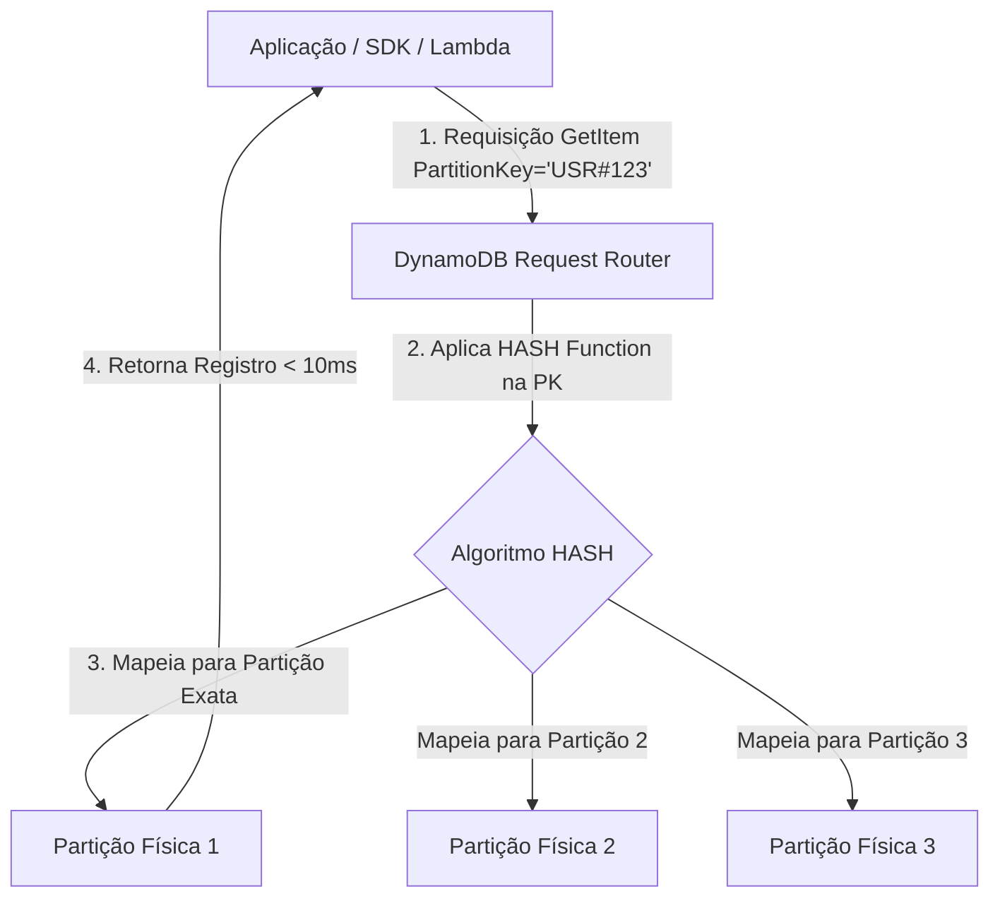
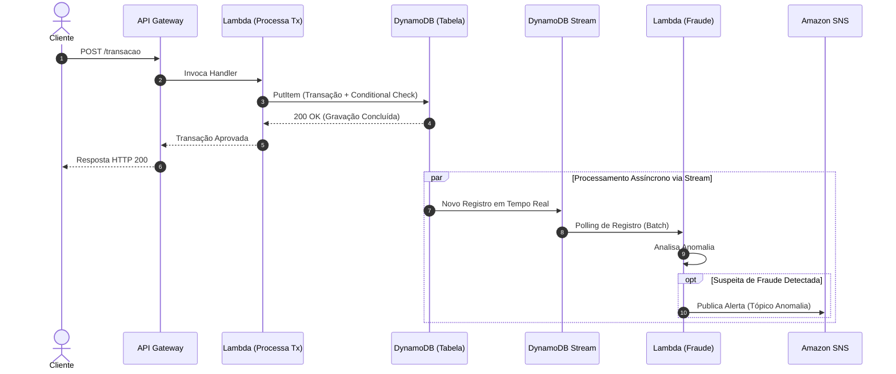

# Amazon DynamoDB

## O que é

O **Amazon DynamoDB** é um banco de dados NoSQL totalmente gerenciado, baseados em chave-valor e documentos, projetado para oferecer latência de um único dígito em milissegundos (*single-digit millisecond latency*) em qualquer escala. Para o desenvolvedor, ele é essencialmente uma tabela distribuída e altamente disponível, onde você não precisa administrar servidores, configurar partições de disco, gerenciar réplicas ou aplicar *patches* de software.

O DynamoDB troca a flexibilidade de consultas relacionais arbitrárias (como os comandos `JOIN`, `GROUP BY` e consultas ad-hoc do SQL) por escala previsível e performance constante, independentemente de a sua tabela ter 10 megabytes ou 10 petabytes.

> 💡 **Nota de Exame:** Quando a questão mencionar **"latência de um dígito de milissegundo em qualquer escala"**, **"banco NoSQL totalmente gerenciado"** ou **"arquitetura serverless com chave-valor/documento"**, a resposta quase certamente envolverá o **Amazon DynamoDB**.

---

## Qual problema resolve

Bancos de dados relacionais tradicionais (RDBMS) como PostgreSQL ou MySQL foram projetados para rodar em um único servidor principal (*scale-up*). Conforme a quantidade de dados e requisições cresce, o RDBMS exige máquinas cada vez maiores e mais caras. Ao tentar particionar (*sharding*) um banco relacional entre dezenas de servidores, você perde a capacidade de fazer `JOINs` eficientes e transações ACID ACID com baixa latência.

O DynamoDB resolve:

1. **Gargalo de Escala Relacional:** Ele escala horizontalmente (*scale-out*) de forma transparente, distribuindo dados e carga em múltiplos servidores por meio de partições internas.
2. **Inconsistência de Performance sob Carga:** Em um RDBMS, uma consulta sem índice pode travar o banco à medida que a tabela cresce. No DynamoDB, o tempo de resposta para buscar um item pela chave primária é **exatamente o mesmo** com 1.000 ou 1.000.000.000 de registros.
3. **Complexidade de Gerenciamento de Infraestrutura:** Elimina a necessidade de gerenciar nós, réplicas de leitura, backups manuais e partições.

---

## Quando utilizar

* **Aplicações de Alto Tráfego/Escala Massiva:** Carrinhos de compras de e-commerce, sistemas de recomendação em tempo real e jogos multiplayer (placar/sessões).
* **Armazenamento de Estado de Sessão e Cache:** Armazenar tokens JWT, sessões de usuário ou estado de carrinhos com expiração automática via TTL (*Time to Live*).
* **Workloads Serverless Orientados a Eventos:** Integração nativa com AWS Lambda e API Gateway para criação de microsserviços sem estado (*stateless*).
* **Aplicações com Padrões de Acesso Bem Definidos:** Casos de uso em que você sabe de antemão exatamente quais consultas serão realizadas (design orientado a padrões de acesso / *Single-Table Design*).

---

## Quando NÃO utilizar

* **Necessidade de Consultas Ad-hoc e Agregações Complexas:** Relatórios gerenciais, analytics com múltiplos `JOINs`, `GROUP BY`, ou somatórias sobre toda a base. *Alternativa:* **Amazon Redshift**, **Amazon Athena** ou **Amazon Aurora**.
* **Dados Altamente Relacionais com Padrões de Acesso Imprevisíveis:** Aplicações em que os usuários criam filtros e relatórios arbitrários dinamicamente. *Alternativa:* **Amazon Aurora** ou **Amazon RDS**.
* **Armazenamento de Arquivos Grandes/Binários:** Salvar vídeos, imagens ou grandes blobs JSON (> 400 KB). *Alternativa:* **Amazon S3** (armazenando apenas a URL ou metadados no DynamoDB).

---

## Como funciona

O funcionamento interno do DynamoDB baseia-se em **particionamento de dados automatizado**:



1. **Roteamento de Requisição:** O cliente faz uma chamada utilizando a AWS SDK enviando a chave primária.
2. **Função Hash Interna:** O *Request Router* aplica uma função *hash* interna no valor da **Partition Key** (PK).
3. **Mapeamento de Partição:** O resultado do *hash* indica exatamente em qual **Partição Física** (servidor interno gerenciado pela AWS) o dado está armazenado.
4. **Armazenamento e Replicação:** O dado é gravado na partição primária e replicado de forma síncrona em **3 Zonas de Disponibilidade (AZs)** dentro da mesma Região AWS antes de confirmar a escrita bem-sucedida (para leituras com consistência forte).

---

## Principais componentes

* **Table (Tabela):** Coleção de itens. O DynamoDB é *schemaless* (sem esquema rígido), exceto pela exigência da chave primária.
* **Item:** Um registro individual dentro da tabela (semelhante a uma linha em RDBMS ou documento no MongoDB). Tamanho máximo por item: **400 KB**.
* **Attribute (Atributo):** Elemento de dado fundamental de um item (semelhante a uma coluna). Pode ser escalar (String, Number, Binary, Boolean, Null) ou complexo (List, Map, Set).
* **Partition Key (PK / Hash Key):** Atributo obrigatório usado pela função *hash* do DynamoDB para distribuir itens entre partições físicas.
* **Sort Key (SK / Range Key):** Atributo opcional que, junto com a Partition Key, forma uma **Chave Primária Composta**. Permite ordenar itens com a mesma PK e realizar buscas por intervalo (`begins_with`, `between`, `>`, `<`).
* **Global Secondary Index (GSI):** Índice criado com PK e SK **diferentes** das da tabela base. Pode ser criado ou excluído a qualquer momento e possui throughput (RCU/WCU) próprio.
* **Local Secondary Index (LSI):** Índice que compartilha a **mesma PK** da tabela base, mas usa uma **SK diferente**. Só pode ser criado no momento da criação da tabela e compartilha o throughput com a tabela base.

---

## Conceitos importantes

### 1. Modelos de Consistência de Leitura

* **Eventually Consistent Reads (Leituras Eventualmente Consistentes - Padrão):**
* Maximiza o throughput de leitura.
* Pode não refletir o resultado de uma escrita recente imediatamente (geralmente sincronizado em menos de 1 segundo em todas as 3 AZs).
* Consome **metade da capacidade de leitura** (1 RCU cobre 2 leituras de 4 KB).


* **Strongly Consistent Reads (Leituras Fortemente Consistentes):**
* Retorna uma resposta com os dados de todas as escritas anteriores que receberam confirmação de sucesso.
* Requer requisição explícita na chamada do SDK (`ConsistentRead=True`).
* Consome o **dobro da capacidade** em relação à eventualmente consistente (1 RCU cobre 1 leitura de 4 KB).
* *Não é suportado em GSIs.*


### 2. Unidades de Capacidade (RCU e WCU) - Modo Provisionado

> ⚠️ **Atenção total para os cálculos da prova!** A AWS adora cobrar dimensionamento de RCU e WCU.

* **WCU (Write Capacity Unit):**
* 1 WCU representa **1 escrita por segundo** para um item de até **1 KB**.
* Se o item tiver 1,5 KB, arredonda-se para cima: **2 KB = 2 WCUs**.


* **RCU (Read Capacity Unit):**
* 1 RCU representa **1 leitura fortemente consistente por segundo** (ou 2 leituras eventualmente consistentes) para um item de até **4 KB**.
* Se o item tiver 6 KB:
* Arredonda para o próximo múltiplo de 4 KB $\rightarrow$ **8 KB**.
* Leitura Fortemente Consistente: $8 / 4 = \mathbf{2\text{ RCUs}}$.
* Leitura Eventualmente Consistente: $2 / 2 = \mathbf{1\text{ RCU}}$.
* Leitura Transacional: $2 \times 2 = \mathbf{4\text{ RCUs}}$.


### 3. Modos de Capacidade: Provisioned vs. On-Demand

| Métrica / Cenário | Provisioned Mode | On-Demand Mode |
| --- | --- | --- |
| **Funcionamento** | Você especifica o número de RCUs e WCUs desejados por segundo. | Escala instantaneamente de acordo com o tráfego recebido. |
| **Auto Scaling** | Suporta DynamoDB Auto Scaling para ajustar RCU/WCU automaticamente. | Sem necessidade de dimensionamento. |
| **Cobrança** | Paga pelo valor alocado por hora (usado ou não). | Paga estritamente por requisição efetuada. |
| **Ideal Para** | Tráfego previsível, estável ou com picos graduais. Menor custo a longo prazo. | Tráfego imprevisível, cargas de trabalho desconhecidas ou aplicações serverless de baixo uso. |

### 4. DynamoDB Streams e Padrões Event-Driven

O DynamoDB Streams captura uma sequência cronológica, ordenada e com garantia de tempo limite de modificações em nível de item em uma tabela (inserções, atualizações e exclusões).

* O stream armazena os registros por até **24 horas** (limite fixo).
* **View Types:**
1. `KEYS_ONLY`: Apenas a chave primária do item modificado.
2. `NEW_IMAGE`: O item completo exatamente como ficou após a modificação.
3. `OLD_IMAGE`: O item completo exatamente como era antes da modificação.
4. `NEW_AND_OLD_IMAGES`: Tanto a imagem antiga quanto a nova do item.


* **Casos de Uso Principais:** Disparar funções **AWS Lambda** para auditoria, sincronização em tempo real com Amazon OpenSearch (para busca textual) ou replicação/notificações via SNS/SQS.

```python
# Exemplo de evento recebido pelo Lambda via DynamoDB Stream
{
    "Records": [
        {
            "eventName": "MODIFY",
            "dynamodb": {
                "Keys": {"UserId": {"S": "USR#999"}},
                "NewImage": {"Status": {"S": "ATIVO"}, "Saldo": {"N": "150.00"}},
                "OldImage": {"Status": {"S": "PENDENTE"}, "Saldo": {"N": "0.00"}},
                "SequenceNumber": "11100000000000001",
                "SizeBytes": 128,
                "StreamViewType": "NEW_AND_OLD_IMAGES"
            }
        }
    ]
}

```

---

## Segurança

* **IAM Identity-based Policies:** Define as ações que um usuário, grupo ou role pode executar na tabela (`dynamodb:GetItem`, `dynamodb:PutItem`, `dynamodb:Query`, `dynamodb:Scan`).
* **Fine-Grained Access Control (FGAC):** Permite restringir o acesso a itens específicos dentro da tabela com base no ID do usuário autenticado (geralmente via Amazon Cognito). Utiliza a condição `dynamodb:LeadingKeys` na política IAM.

```json
{
  "Version": "2012-10-17",
  "Statement": [
    {
      "Effect": "Allow",
      "Action": ["dynamodb:GetItem", "dynamodb:PutItem"],
      "Resource": "arn:aws:dynamodb:us-east-1:123456789012:table/MinhaTabela",
      "Condition": {
        "ForAllValues:StringEquals": {
          "dynamodb:LeadingKeys": ["${cognito-identity.amazonaws.com:sub}"]
        }
      }
    }
  ]
}

```

* **Criptografia em Repouso (Encryption at Rest):** Sempre ativada por padrão usando chaves gerenciadas pela AWS (AWS Owned KMS Key), Chaves Gerenciadas pelo Cliente (AWS Managed KMS Key) ou KMS CMK do Cliente.
* **Criptografia em Trânsito:** Todas as chamadas de API são feitas estritamente sobre HTTPS/TLS.
* **VPC Endpoints (Gateway Endpoint):** Permite que funções Lambda e instâncias EC2 em subnets privadas acessem o DynamoDB diretamente pela rede da AWS, sem passar pela internet pública ou precisar de NAT Gateway.

---

## Performance

### 1. Hot Partitions (Partições Quentes) e Hot Keys

Ocorrem quando o tráfego de leitura/escrita fica desproporcionalmente concentrado em uma única Partition Key (ex: criar uma PK baseada no atributo `Pais` onde 95% das inserções são `BR`).

* **Solução:** Adicionar um sufixo aleatório ou calculado (*Partition Sharding* / *Salt*) à Partition Key para espalhar os dados entre diferentes partições físicas (ex: `BR#1`, `BR#2`, `BR#3`).

### 2. Query vs. Scan (Fundamental para a Prova!)

| Operação | Como Funciona | Impacto em Performance e Custo |
| --- | --- | --- |
| **`Query`** | Busca itens utilizando **exclusivamente a Partition Key** (e opcionalmente filtros na Sort Key). | **Altamente Eficiente:** Lê apenas os itens necessários diretamente da partição. Consome poucos RCUs. |
| **`Scan`** | Varre a **tabela inteira** de ponta a ponta, avaliando item por item. | **Péssima Performance:** Lento e extremamente caro. Consome RCU equivalente ao tamanho total da tabela inteira, mesmo se filtrar e retornar 1 único item. |

> 💡 **Nota de Exame:** Para otimizar uma operação `Scan` que é inevitável, utilize a flag **`Parallel Scan`**. Isso divide a tabela em segmentos lógicos processados em paralelo por múltiplas threads/workers. Isso **reduz a latência**, mas **NÃO reduz o consumo de RCU/custo**.

### 3. Caching com DAX (DynamoDB Accelerator)

* É um cache em memória (*in-memory cache*) totalmente gerenciado e compatível com as APIs do DynamoDB (requer mínima alteração no código do SDK).
* Reduz os tempos de resposta de milissegundos para **microsegundos** ($\mu s$).
* **Estratégia de Cache:** *Write-through* (escreve no DAX e no DynamoDB simultaneamente).
* Ideal para aplicações com leitura intensiva (*read-heavy*) de chaves populares (*read hot spots*).

---

## Custos

1. **Modo de Capacidade:**
* **Provisioned:** Você paga pela taxa estipulada por RCU e WCU alocados por hora.
* **On-Demand:** Paga por milhão de requisições de escrita e leitura efetuadas.


2. **Armazenamento de Dados:** Cobrado por GB por mês ocupado na tabela (os primeiros 25 GB/mês são gratuitos no Free Tier).
3. **Recursos Adicionais (Podem encarecer rapidamente):**
* **DAX:** Paga por nó/hora do cluster provisionado.
* **Global Tables:** Cobrado pela transferência de dados inter-regional e pelas WCUs duplicadas gravadas nas regiões de destino.
* **Backups e Point-in-Time Recovery (PITR):** Cobrado por GB armazenado de backup.


4. **Estratégias de Redução de Custos:**
* Utilizar **TTL (*Time to Live*)** para deletar automaticamente dados expirados sem consumir nenhuma WCU.
* Utilizar **`ProjectionExpression`** nas consultas para retornar apenas os atributos necessários na resposta do SDK (reduz payload de rede).


---

## Integrações

* **AWS Lambda:** Processamento sem servidor alimentado por *DynamoDB Streams* ou APIs síncronas.
* **Amazon API Gateway:** Integração direta (Direct Service Integration) via VTL (Velocity Template Language), permitindo ler/escrever no DynamoDB **sem necessidade de passar por uma função Lambda**, reduzindo latência e custo.
* **Amazon Cognito:** Autenticação de usuários combinada com *Fine-Grained Access Control* no IAM.
* **AWS AppSync (GraphQL):** Utiliza o DynamoDB como fonte primária de dados (*Data Source*) com suporte nativo a resolver mappings.
* **Amazon OpenSearch Service:** Sincronização via Lambda/Streams para habilitar pesquisas por palavra-chave (*full-text search*).

---

## Comparações

| Característica | Amazon DynamoDB | Amazon Aurora (RDBMS) | Amazon ElastiCache (Redis) |
| --- | --- | --- | --- |
| **Modelo de Dados** | NoSQL (Chave-Valor / Documento) | Relacional (SQL / ACID) | Em Memória (Chave-Valor) |
| **Escalabilidade** | Horizontal automática (sem limite) | Vertical + Réplicas de Leitura | Clusters com Réplicas em Memória |
| **Latência** | Milissegundos (< 10ms) | Milissegundos curtos (~10-20ms) | Microsegundos (< 1ms) |
| **Suporte a JOINs** | Não suportado (Design de tabela única) | Suporte completo a SQL complexo | Não suportado |
| **Casos de Uso** | Escala maciça, serverless, sessões | Sistemas ERP, relatórios, transacional complexo | Caching temporário, pub/sub, leaderboards |

---

| Característica | Global Secondary Index (GSI) | Local Secondary Index (LSI) |
| --- | --- | --- |
| **Chave de Partição (PK)** | Pode ser **diferente** da tabela base | Deve ser **idêntica** à tabela base |
| **Chave de Classificação (SK)** | Pode ser **diferente** da tabela base | Deve ser **diferente** da tabela base |
| **Momento de Criação** | Qualquer momento (Criação ou Pós-criação) | **Apenas na criação da tabela** (Não editável) |
| **Throughput (RCU/WCU)** | **Próprio / Independente** da tabela base | **Compartilhado** com a tabela base |
| **Limites de Tamanho** | Sem limite de tamanho por partição | Máximo de **10 GB por Item Collection** (PK) |
| **Consistência de Leitura** | Apenas **Eventually Consistent** | Suporta **Eventually** e **Strongly Consistent** |

---

## Pegadinhas da certificação

* 🛑 **`Scan` com `FilterExpression` NÃO economiza RCU:** O filtro (`FilterExpression`) é aplicado **DEPOIS** que o DynamoDB varre e lê os dados do disco. Portanto, um Scan que lê 100 MB de dados e filtra retornando apenas 1 KB cobrará RCU equivalente ao processamento dos 100 MB inteiros!
* 🛑 **LSI não pode ser adicionado após a tabela ser criada:** Se a questão disser *"A equipe precisa adicionar um novo LSI em uma tabela DynamoDB em produção existente"*, a resposta é **impossível diretamente**. É preciso criar uma nova tabela ou usar um **GSI**.
* 🛑 **Exclusões do TTL não gastam WCU:** A remoção de itens pelo mecanismo interno de TTL (*Time to Live*) acontece em segundo plano de forma gratuita e não consome Unidades de Capacidade de Escrita (WCU).
* 🛑 **Erros de Throttling (`ProvisionedThroughputExceededException`):** A solução no lado da aplicação para tratar rajadas de tráfego que excedem a cota provisionada é implementar **Exponential Backoff com Jitter** no código ou habilitar o Auto Scaling.

---

## Questões clássicas

**Questão 1:** *Uma aplicação móvel serverless precisa permitir que cada usuário autenticado pelo Amazon Cognito leia e atualize apenas os seus próprios dados em uma tabela compartilhada do DynamoDB. Qual é a solução arquitetural com menor esforço operacional?*

* **Raciocínio:** O requisito pede restrição em nível de item (*fine-grained access control*) baseada na identidade do Cognito. A forma nativa de fazer isso sem criar um middleware customizado é anexar uma política IAM à role do Cognito usando a variável de condição `dynamodb:LeadingKeys` mapeada para `${cognito-identity.amazonaws.com:sub}`.

**Questão 2:** *Um desenvolvedor está criando uma função Lambda para processar eventos do DynamoDB Streams. Durante o teste em ambiente de staging, a função encontra um erro de código ao processar uma mensagem corrompida e para de processar todo o restante do lote. O que está acontecendo e como resolver?*

* **Raciocínio:** O DynamoDB Streams entrega registros ordenados por partição. Se a função Lambda lança uma exceção não tratada ao processar um *shard*, o Lambda continuará retentando o processamento daquele lote com erro indefinidamente para preservar a ordem dos dados, bloqueando o stream. A solução é tratar o erro no código, configurar um **Dead Letter Queue (DLQ)** ou habilitar a opção **`Bisect on Function Error`** na configuração do evento no Lambda.

---

## Cenário real

Uma empresa de meios de pagamento precisa processar transações financeiras de alta frequência. O sistema deve validar o saldo do cliente em menos de 10 ms, registrar o extrato da transação, publicar um evento para detecção de fraudes em tempo real e expirar tokens de autorização temporários em 15 minutos.

### Solução Arquitetural:

1. **API Gateway + Lambda:** Recebe a requisição HTTP e valida a chamada.
2. **DynamoDB (Tabela `Transacoes`):**
* Usa chave primária composta: `PK` (`CLIENTE#100200`) e `SK` (`TX#2026-07-23T12:00:00`).
* **Conditional Writes (`attribute_not_exists`)** para garantir idempotência e evitar transações duplicadas.
* Atributo `TTL` configurado para remover automaticamente tokens de autorização expirados.


3. **DynamoDB Streams:** Envia os dados da transação em tempo real para uma função **Lambda de Fraude**, que analisa os dados e notifica via **SNS** caso detecte anomalia.

---

## Fluxo da arquitetura



---

## Resumo executivo

* **Modelo:** NoSQL chave-valor e documento, totalmente gerenciado, escalabilidade ilimitada.
* **Chaves:** Partition Key (obrigatória/hash) e Sort Key (opcional/range).
* **Consistência:** Eventually Consistent (padrão - consome $1/2$ RCU) vs Strongly Consistent (consome $1$ RCU).
* **Limites:** Tamanho máximo de item: **400 KB**. Retenção do DynamoDB Stream: **24 horas**.
* **Índices:**
* **GSI:** Qualquer PK/SK, criado a qualquer momento, RCU/WCU próprios, apenas consistência eventual.
* **LSI:** Mesma PK/SK diferente, criado apenas junto com a tabela, compartilha RCU/WCU, limite de 10 GB por partição.


* **Otimização:** Prefira **`Query`** em vez de **`Scan`**. Use **DAX** para latência em microsegundos.
* **Eventos:** Use **DynamoDB Streams** acoplado ao Lambda para arquiteturas *event-driven*.

---

## Flashcards

**Pergunta:** Qual o tamanho máximo de um item individual no DynamoDB?

**Resposta:** 400 KB (incluindo nomes dos atributos e valores).

---

**Pergunta:** Qual é a diferença entre um Global Secondary Index (GSI) e um Local Secondary Index (LSI) em relação à criação?

**Resposta:** O LSI só pode ser criado no momento da criação da tabela. O GSI pode ser criado a qualquer momento (na criação ou em tabelas já existentes).

---

**Pergunta:** O que acontece quando você faz uma operação `Scan` usando um `FilterExpression`?

**Resposta:** O DynamoDB varre a tabela inteira, cobra RCU pelo tamanho total dos dados lidos do disco e só DEPOIS aplica o filtro para retornar a resposta. Não economiza RCU.

---

**Pergunta:** Quantas WCUs são necessárias para gravar um item de 3,2 KB de tamanho?

**Resposta:** 4 WCUs. (Cada WCU cobre 1 KB, e o valor de 3,2 KB é arredondado para cima, para 4 KB).

---

**Pergunta:** Quantas RCUs são necessárias para fazer uma leitura FORTEMENTE consistente de um item de 6 KB?

**Resposta:** 2 RCUs. (6 KB arredonda para o múltiplo de 4 KB mais próximo $\rightarrow$ 8 KB. Como cada RCU fortemente consistente cobre 4 KB: $8 / 4 = 2$ RCUs).

---

**Pergunta:** Como o DynamoDB lida com o expurgo de itens que possuem o recurso TTL (Time to Live) ativado?

**Resposta:** O expurgo ocorre automaticamente em segundo plano pela AWS dentro de alguns dias após a expiração, de forma gratuita e sem consumir WCUs da tabela.

---

**Pergunta:** Qual o tempo máximo que um registro permanece disponível no DynamoDB Streams?

**Resposta:** 24 horas (limite fixo e não configurável).

---

**Pergunta:** Qual recurso do DynamoDB deve ser ativado para permitir o acesso de subnets privadas ao serviço sem trafegar pela internet?

**Resposta:** Gateway VPC Endpoint para DynamoDB.

---

**Pergunta:** Qual atributo da política IAM é utilizado para implementar Fine-Grained Access Control (FGAC) e restringir itens ao id do usuário?

**Resposta:** `dynamodb:LeadingKeys`.

---

**Pergunta:** Qual é a solução de cache oficial para o DynamoDB que oferece latência em microsegundos sem necessidade de alterar a lógica complexa do código?

**Resposta:** Amazon DAX (DynamoDB Accelerator).

---

## Checklist Final

* [ ] Sei calcular RCU e WCU para diferentes tamanhos de itens e modelos de consistência.
* [ ] Sei a diferença exata entre `Query` e `Scan` e sei quando usar `Parallel Scan`.
* [ ] Conheço a diferença entre GSI e LSI (criação, consistência, throughput e limites de tamanho).
* [ ] Entendo o funcionamento do DynamoDB Streams e sua integração com AWS Lambda.
* [ ] Sei aplicar *Fine-Grained Access Control* usando a condição `dynamodb:LeadingKeys`.
* [ ] Entendo como tratar exceções do tipo `ProvisionedThroughputExceededException` (Exponential Backoff + Jitter).

---

## Erros comuns

* ❌ Usar `Scan` para buscas em produção achando que o `FilterExpression` vai reduzir o custo da leitura.
* ❌ Tentar criar um Local Secondary Index (LSI) em uma tabela que já está rodando em produção.
* ❌ Salvar arquivos binários grandes (ex: imagens de 2 MB) diretamente como atributo no DynamoDB (ultrapassando o limite de 400 KB e destruindo o throughput).
* ❌ Não tratar falhas de escrita/leituras causadas por *Hot Partitions* (falta de espalhamento adequado de dados na Partition Key).

---

## Dicas do Exame

* **"Single-digit millisecond latency at scale":** Resposta é **DynamoDB**.
* **"Microsecond latency for read-heavy workloads":** Resposta é **DAX (DynamoDB Accelerator)**.
* **"User can only access their own items":** Procure políticas IAM contendo a chave **`dynamodb:LeadingKeys`**.
* **"Capture real-time item-level changes":** Resposta é **DynamoDB Streams**.
* **"ProvisionedThroughputExceededException":** A solução envolve **Exponential Backoff com Jitter** ou trocar para o **On-Demand Mode**.

---

## 20 Conceitos Mais Importantes Estudados

1. **Partition Key (Hash Key)**
2. **Sort Key (Range Key)**
3. **Item Limit (400 KB)**
4. **Read Capacity Units (RCU)**
5. **Write Capacity Units (WCU)**
6. **Eventually Consistent Reads**
7. **Strongly Consistent Reads**
8. **On-Demand vs. Provisioned Capacity**
9. **Global Secondary Index (GSI)**
10. **Local Secondary Index (LSI)**
11. **Query vs. Scan**
12. **DynamoDB Streams**
13. **Time to Live (TTL)**
14. **DynamoDB Accelerator (DAX)**
15. **Fine-Grained Access Control (`dynamodb:LeadingKeys`)**
16. **Hot Partitions & Sharding (Salting)**
17. **Conditional Writes (`attribute_not_exists`)**
18. **`ProvisionedThroughputExceededException`**
19. **VPC Gateway Endpoint**
20. **Parallel Scan**