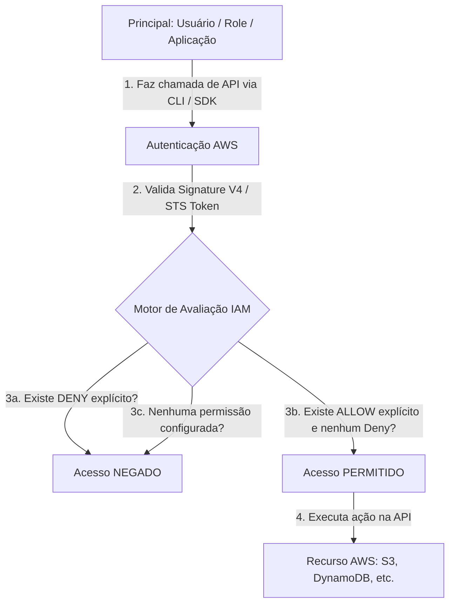
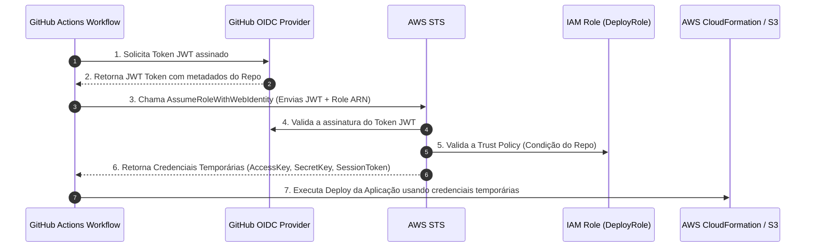

# AWS Identity and Access Management (IAM)

## O que é

O **AWS Identity and Access Management (IAM)** é a espinha dorsal de controle de acesso, autenticação e autorização em todo o ecossistema AWS. Ele determina **quem** (identidade) pode fazer **o quê** (ações) em **qual recurso** (recurso AWS) sob **quais condições**.

Para um desenvolvedor, o IAM não é apenas uma ferramenta de segurança administrativa, mas uma API viva de controle de permissões. Ele é um serviço global por padrão (não depende de região) e atua como o porteiro de todas as chamadas de API feitas por usuários humanos, aplicações, contêineres e serviços AWS.

> 💡 **Nota de Exame:** O IAM é a base do modelo de **Responsabilidade Compartilhada da AWS**. A AWS garante a infraestrutura e a segurança do serviço IAM, enquanto **você é 100% responsável** por gerenciar permissões, criar políticas com menor privilégio e proteger credenciais.

---

## Qual problema resolve

Antes dos sistemas de gestão de identidade granulares como o IAM, o acesso a recursos em nuvem era feito via compartilhamento de credenciais mestre (*Root Keys*) ou credenciais estáticas salvas no código.

O IAM resolve:

1. **Risco de Credenciais Vazadas no Código:** Permite conceder credenciais temporárias a serviços (como EC2 ou Lambda) via **IAM Roles**, eliminando *Access Keys* codificadas (*hardcoded*).
2. **Falta de Granularidade de Permissão:** Evita acessos do tipo "tudo ou nada". Com o IAM, você pode permitir que um microsserviço escreva em uma única tabela do DynamoDB e nada mais.
3. **Complexidade de Federação e Acesso Cross-Account:** Resolve o desafio de integrar identidades corporativas existentes (Active Directory, Okta, Google Workspace) ou dar acesso seguro entre diferentes contas da AWS sem duplicar usuários.

---

## Quando utilizar

* **Conceder Permissões a Aplicações e Serviços AWS:** Anexar IAM Roles a funções Lambda, tarefas do ECS ou instâncias EC2 para consumir S3, DynamoDB, SQS, etc.
* **Autenticação e Autorização para Desenvolvedores e CI/CD:** Configurar acessos via AWS IAM Identity Center (sucessor do AWS Single Sign-On) ou GitHub Actions via OIDC (*OpenID Connect*).
* **Gerenciamento de Acesso Entre Contas (*Cross-Account Access*):** Permitir que uma aplicação na Conta A acesse um bucket S3 ou um tópico SNS localizado na Conta B.
* **Controle de Acesso Baseado em Condições:** Restringir acessos com base em IP de origem, presença de MFA, horário ou tags de recursos (*Attribute-Based Access Control - ABAC*).

---

## Quando NÃO utilizar

* **Autenticação e Gestão de Usuários da Sua Aplicação Final (End-Users):** Se você está construindo um app mobile ou SaaS e precisa gerenciar o login dos clientes do app (cadastro, login social com Google/Facebook, MFA de cliente). *Alternativa:* **Amazon Cognito User Pools**.
* **Controle de Acesso em Nível de Linha/Coluna em Banco de Dados Relacional:** O IAM gerencia acesso de rede e credenciais ao banco de dados (ex: IAM Database Authentication no RDS), mas não as tabelas internas SQL. *Alternativa:* Permissões SQL nativas do banco (`GRANT`/`REVOKE`).
* **Gerenciamento de Acesso B2C/B2B em Escala Externa:** O IAM tem limites de cota para usuários e roles. Não deve ser usado como diretório de identidades para milhões de clientes externos.

---

## Como funciona

O ciclo de vida de uma requisição na AWS passa obrigatoriamente pelo motor de autorização do IAM:



### O Algoritmo de Avaliação de Políticas do IAM (Fundamental para a Prova!)

Quando uma chamada de API é feita, o IAM avalia todas as políticas aplicáveis na seguinte ordem estrita:

1. **Negação Padrão (*Implicit Deny*):** Por padrão, toda requisição começa como **NEGADA**.
2. **Negação Explícita (*Explicit Deny*):** O IAM busca qualquer instrução com `"Effect": "Deny"`. Se encontrar **UM ÚNICO DENY** que se aplique à requisição, a resposta final será **ACESSO NEGADO**, anulando qualquer permissão anterior ou posterior.
3. **Permissão Explícita (*Explicit Allow*):** Se não houver negação explícita, o IAM busca por uma instrução `"Effect": "Allow"`. Se existir, o acesso é **PERMITIDO**.
4. **Permissão Ausente:** Se não houver nem *Deny* nem *Allow* explícito, a requisição cai na **Negação Implícita** e o acesso é **NEGADO**.

---

## Principais componentes

* **Root User:** O usuário criador da conta AWS. Possui acesso irrestrito a tudo. **Boas Práticas:** Ativar MFA imediatamente, remover Access Keys e nunca usar para tarefas diárias ou código.
* **IAM User:** Uma identidade individual (pessoa ou aplicação) dentro da conta. Possui credenciais de longo prazo (Senha ou Access Key ID + Secret Access Key).
* **IAM Group:** Uma coleção de usuários IAM. Usado para aplicar permissões a múltiplos usuários simultaneamente (não pode conter outros grupos e não é uma identidade passível de login).
* **IAM Role:** Uma identidade com permissões específicas que **não possui credenciais de longo prazo** (sem senha ou chaves estáticas). É **assumida** por humanos, aplicações ou serviços AWS por um período determinado.
* **IAM Policy:** Um documento JSON que define permissões (quem pode fazer o quê).
* **AWS STS (Security Token Service):** O serviço responsável por emitir **credenciais temporárias** (Access Key, Secret Key e Session Token) quando uma IAM Role é assumida.

---

## Conceitos importantes

### 1. Anatomia de uma IAM Policy JSON

Toda política IAM válida é composta pelos seguintes elementos estruturais:

```json
{
  "Version": "2012-10-17",
  "Statement": [
    {
      "Sid": "PermitirAcessoAosArquivosS3",
      "Effect": "Allow",
      "Principal": { "AWS": "arn:aws:iam::123456789012:role/MinhaAppRole" },
      "Action": [
        "s3:GetObject",
        "s3:PutObject"
      ],
      "Resource": "arn:aws:s3:::meu-bucket-de-dados/*",
      "Condition": {
        "Bool": { "aws:SecureTransport": "true" }
      }
    }
  ]
}

```

* **Version:** Sempre use `"2012-10-17"` (versão atual da linguagem de política). Nunca use a data do dia!
* **Statement:** Array contendo um ou mais blocos de regras.
* **Effect:** `"Allow"` ou `"Deny"`.
* **Principal:** Especifica **QUEM** recebe a permissão. *Atenção:* Só é usado em **Resource-based Policies** ou em **Trust Policies** de Roles. Políticas de identidade (*Identity-based*) não possuem o campo `Principal`.
* **Action:** Lista de chamadas de API permitidas ou negadas (ex: `s3:GetObject`, `dynamodb:PutItem`).
* **Resource:** O ARN (*Amazon Resource Name*) do recurso sobre o qual as ações incidem.
* **Condition:** Critérios/restrições extras sob os quais a política é válida (ex: exige HTTPS via `aws:SecureTransport`, restrição de IP com `aws:SourceIp` ou contexto de tags).

### 2. Identity-Based Policies vs. Resource-Based Policies

| Característica | Identity-Based Policies | Resource-Based Policies |
| --- | --- | --- |
| **Onde é anexada?** | Em Usuários, Grupos ou Roles IAM. | Diretamente no Recurso AWS (S3 Bucket, SQS Queue, KMS Key, Secrets Manager). |
| **Possui campo `Principal`?** | **NÃO** (O principal é a identidade onde ela está anexada). | **SIM** (Obrigatorio: especifica quem tem permissão no recurso). |
| **Acesso Cross-Account?** | Requer que a conta receptora assuma uma Role na conta de destino. | Permite acesso direto entre contas sem necessidade de assumir uma Role (se o recurso suportar). |
| **Gerenciamento** | Gerenciada no IAM. | Gerenciada na configuração do próprio serviço do recurso. |

### 3. Trust Policy vs. Permissions Policy em uma IAM Role

Uma **IAM Role** é dividida em duas partes distintas que a prova cobra constantemente:

1. **Trust Policy (Política de Confiança):** Define **QUEM PODE ASSUMIR** a Role. Utiliza o campo `Principal` e a ação `sts:AssumeRole`.
2. **Permissions Policy (Política de Permissões):** Define **O QUE A ROLE PODE FAZER** depois de ser assumida.

```json
// Exemplo de TRUST POLICY em uma Role permitindo que o AWS Lambda assuma a Role
{
  "Version": "2012-10-17",
  "Statement": [
    {
      "Effect": "Allow",
      "Principal": {
        "Service": "lambda.amazonaws.com"
      },
      "Action": "sts:AssumeRole"
    }
  ]
}

```

### 4. Credenciais Temporárias via AWS STS

O **AWS STS** é o motor por trás do acesso dinâmico na AWS. As chamadas de API mais importantes cobradas no exame são:

* **`sts:AssumeRole`:** Usada por aplicações, usuários ou serviços para assumir uma Role e obter credenciais temporárias (duração de 15 min a 12 horas).
* **`sts:AssumeRoleWithWebIdentity`:** Usada para federação com provedores OIDC compatíveis com OpenID Connect (ex: GitHub Actions, Google, Cognito).
* **`sts:GetCallerIdentity`:** Retorna detalhes da identidade atual (Account ID, User/Role ARN). É a chamada clássica usada em scripts para validar se as credenciais funcionam (`aws sts get-caller-identity`).

---

## Segurança

* **Princípio do Menor Privilégio (*Least Privilege*):** Conceda **apenas** as ações exatas necessárias nos recursos específicos. Nunca use `"Action": "*"` ou `"Resource": "*"` em ambiente de produção.
* **Proibição de Access Keys Hardcoded:** Desenvolvedores **nunca** devem colar `AWS_ACCESS_KEY_ID` e `AWS_SECRET_ACCESS_KEY` no código, repositórios Git ou arquivos de configuração local.
* **Uso de Instance Profiles e Role Executions:**
* **EC2:** Usa *IAM Instance Profile* para passar credenciais temporárias automaticamente para a instância via *Instance Metadata Service (IMDSv2)*.
* **Lambda / ECS:** Usa *Execution Role* e *Task Role* respectivamente.


* **PassRole (`iam:PassRole`):** Permissão necessária para que um desenvolvedor/usuário consiga **passar** uma IAM Role a um serviço AWS (ex: permitir que o desenvolvedor associe uma Role a uma nova função Lambda).

---

## Performance

* **Escalabilidade do IAM:** O IAM é um serviço global altamente distribuído com disponibilidade quase perfeita.
* **Eventual Consistency:** Alterações em políticas IAM são globalmente distribuídas e possuem **consistência eventual**. Uma atualização de política pode levar alguns segundos para se propagar totalmente em todas as regiões AWS.
* **Caching de Credenciais Temporárias via SDK:** Quando uma aplicação usa AWS SDKs com IAM Roles (ex: no Lambda ou EC2), o SDK faz o cache automático das credenciais temporárias do STS e só solicita novas credenciais pouco antes da expiração, evitando throttling no STS.

---

## Custos

* **Gratuito:** O AWS IAM é um recurso fundamental da AWS e **não possui nenhum custo adicional**. Você pode criar quantas roles, políticas e usuários precisar sem ser cobrado.
* **Custos Indiretos:** As chamadas ao AWS STS a partir de chamadas externas de federação podem ter cotas de limite de taxa (*rate limits*), mas o serviço em si é gratuito.

---

## Integrações

* **AWS Lambda / ECS / EC2:** Utilizam Roles para obter permissões de execução e acesso a outros serviços sem credenciais estáticas.
* **AWS KMS (Key Management Service):** As políticas de chaves do KMS (*KMS Key Policies*) trabalham em conjunto com políticas IAM para autorizar a descriptografia de dados.
* **Amazon S3:** Bucket Policies (Resource-based) trabalham em conjunto com políticas IAM para controle de acesso refinado.
* **AWS Secrets Manager & Parameter Store:** Acesso aos segredos e parâmetros é protegido via IAM.
* **AWS CloudTrail:** Registra todas as chamadas de API e alterações de permissões efetuadas no IAM para fins de auditoria e conformidade.

---

## Comparações

| Característica | IAM User | IAM Role | AWS IAM Identity Center (SSO) |
| --- | --- | --- | --- |
| **Credenciais** | Longo prazo (Senha / Access Keys estáticas). | Temporárias (Geradas via STS). | Temporárias via login centralizado. |
| **Casos de Uso** | Casos legados específicos (evitado atualmente). | Aplicações, serviços AWS e acesso Cross-Account. | Acesso humano centralizado a múltiplas contas AWS. |
| **Risco de Segurança** | Alto (Risco de vazamento de chaves estáticas). | Mínimo (Credenciais expiram automaticamente). | Baixo (Sessões curtas e MFA corporativo). |

---

| Característica | Managed Policy (AWS Managed) | Managed Policy (Customer Managed) | Inline Policy |
| --- | --- | --- | --- |
| **Criada Por** | Criada e mantida pela **AWS**. | Criada e mantida pelo **Cliente**. | Criada diretamente **dentro** da identidade. |
| **Reuso** | Pode ser anexada a múltiplas identidades. | Pode ser anexada a múltiplas identidades. | Relação 1:1 estrita com a identidade pai. |
| **Recomendação** | Útil para testes rápidos (ex: `AdministratorAccess`). | **Melhor prática para produção** (versionada e reutilizável). | **Evitar** (dificulta auditoria e manutenção). |

---

## Pegadinhas da certificação

* 🛑 **`Deny` Explícito SEMPRE vence:** Se uma política diz `Allow s3:*` e outra política anexada ao mesmo usuário diz `Deny s3:DeleteBucket`, o usuário **NÃO conseguirá deletar o bucket**, independentemente da ordem em que foram aplicadas.
* 🛑 **IAM Role NÃO possui senha ou chaves de acesso estáticas:** Se uma questão disser *"Crie uma chave de acesso para a IAM Role..."*, essa alternativa está **errada**.
* 🛑 **Falta da permissão `iam:PassRole`:** Um desenvolvedor tenta criar uma função Lambda e associar uma Role a ela, mas recebe erro `AccessDenied`. O motivo é que o usuário do desenvolvedor não possui a permissão `iam:PassRole` para autorizar a transferência daquela role para o serviço Lambda.
* 🛑 **Conflito entre S3 Bucket Policy e IAM Policy na MESMA conta:** Para um usuário acessar um bucket S3 na mesma conta, basta ter permissão na IAM Policy **OU** na Bucket Policy (desde que nenhuma das duas tenha um `Deny` explícito). Se for entre contas diferentes (**Cross-Account**), é **OBRIGATÓRIO ter o Allow nas DUAS pontas** (na IAM Policy da conta de origem E na Bucket Policy da conta de destino).

---

## Questões clássicas

**Questão 1:** *Um desenvolvedor está construindo uma aplicação em Node.js que roda dentro de um container no AWS Fargate (ECS) e precisa gravar dados em uma tabela do Amazon DynamoDB. Qual é a forma mais segura de fornecer permissões ao container sem hardcoding de credenciais?*

* **Raciocínio:** Para aplicações rodando no ECS/Fargate, o padrão de segurança é associar uma **ECS Task Role** à definição da tarefa. O container assumirá a Role via STS e receberá credenciais temporárias automaticamente pelo SDK. *(Nota: Não confundir Task Role — usada pela aplicação — com Task Execution Role, que é usada pelo agente do ECS para puxar a imagem no ECR e enviar logs para o CloudWatch).*

**Questão 2:** *Uma aplicação rodando na Conta A (ID: 111111111111) precisa ler arquivos de um bucket S3 localizado na Conta B (ID: 222222222222). Qual combinação de configurações é necessária para permitir esse acesso cross-account?*

* **Raciocínio:** Em acessos Cross-Account, a conta de origem e a conta de destino precisam concordar. A opção correta envolve: Criar uma **IAM Role na Conta B** com permissão de leitura no S3 e uma **Trust Policy** permitindo que a Conta A a assuma. Na Conta A, anexar uma política IAM à aplicação permitindo a ação `sts:AssumeRole` direcionada ao ARN da Role na Conta B.

---

## Cenário real

Uma empresa de tecnologia precisa integrar seu pipeline de integração contínua (GitHub Actions) para realizar o deploy automatizado de uma aplicação serverless na AWS sem salvar chaves de acesso estáticas (`AWS_ACCESS_KEY_ID`) nos segredos do repositório do GitHub.

### Solução Arquitetural com OIDC e IAM Role:

1. **Configuração do Identity Provider (IdP):** Registrar o GitHub Actions como um Provedor de Identidade OpenID Connect (OIDC) no AWS IAM.
2. **Criação da IAM Role de Deploy:** Criar uma Role com a Trust Policy restringindo a assunção apenas às execuções do repositório oficial da organização no GitHub (`token.actions.githubusercontent.com:sub`).
3. **Invocação no Workflow:** No pipeline do GitHub, usar a ação oficial `aws-actions/configure-aws-credentials` trocando o token JWT do GitHub por credenciais temporárias do AWS STS.

---

## Fluxo da arquitetura



---

## Resumo executivo

* **Definição:** Serviço global de controle de acesso e autenticação (Quem + Ação + Recurso + Condição).
* **Regra de Ouro de Avaliação:** **Explicit Deny > Explicit Allow > Implicit Deny**.
* **Tipos de Identidade:**
* **User:** Identidade de longo prazo (com senhas/chaves). Evitar para aplicações.
* **Role:** Identidade sem credenciais fixas. Usa o **AWS STS** para obter credenciais temporárias.


* **Componentes da Política:** `Version` ("2012-10-17"), `Statement`, `Effect`, `Principal` (apenas em políticas de recursos/trust), `Action`, `Resource`, `Condition`.
* **Acesso Cross-Account:** Requer confiança na conta de destino e autorização na conta de origem, ou Bucket Policy configurada adequadamente com `Principal` da conta externa.
* **Boas Práticas:** Bloquear Root, usar MFA, aplicar **Least Privilege**, preferir **Customer Managed Policies** e usar **Roles** para tudo em código.

---

## Flashcards

**Pergunta:** Qual é o valor correto que deve ser informado no campo `Version` de um documento de política JSON do IAM?

**Resposta:** `"2012-10-17"`.

---

**Pergunta:** O que acontece quando um usuário é afetado por uma instrução de `Allow` em uma política e por uma instrução de `Deny` em outra política sobre o mesmo recurso?

**Resposta:** O acesso é **NEGADO** (o *Explicit Deny* sempre tem precedência sobre qualquer *Allow*).

---

**Pergunta:** Qual serviço da AWS é responsável por emitir credenciais de acesso temporárias quando uma IAM Role é assumida?

**Resposta:** AWS STS (Security Token Service).

---

**Pergunta:** Qual elemento é obrigatório em uma Resource-Based Policy e em uma Trust Policy, mas NUNCA deve ser incluído em uma Identity-Based Policy?

**Resposta:** O campo `Principal`.

---

**Pergunta:** Como se chama o mecanismo que permite que instâncias EC2 ou tarefas do ECS executem chamadas de API sem precisar de credenciais estáticas salvas no código?

**Resposta:** IAM Instance Profile (para EC2) ou ECS Task Role (para ECS).

---

**Pergunta:** Qual permissão do IAM um desenvolvedor precisa ter para atribuir uma IAM Role existente a um serviço como o AWS Lambda?

**Resposta:** `iam:PassRole`.

---

**Pergunta:** Para acessar um bucket S3 localizado em OUTRA conta AWS (Cross-Account), é necessário que o acesso seja permitido em quais locais?

**Resposta:** Na IAM Policy da conta de origem E na S3 Bucket Policy (ou IAM Role) da conta de destino.

---

**Pergunta:** Qual é a diferença entre uma Customer Managed Policy e uma Inline Policy?

**Resposta:** A Customer Managed Policy é reutilizável e pode ser anexada a múltiplas identidades. A Inline Policy tem uma relação 1:1 rigorosa e fica embutida dentro de uma única identidade.

---

**Pergunta:** Qual comando da AWS CLI é comumente utilizado para testar e verificar qual identidade IAM está realizando as chamadas no ambiente atual?

**Resposta:** `aws sts get-caller-identity`.

---

**Pergunta:** Por que a conta Root da AWS não deve ser utilizada para atividades normais de desenvolvimento?

**Resposta:** Porque a conta Root possui permissões irrestritas que não podem ser limitadas por políticas IAM normais, representando um risco crítico de segurança.

---

## Checklist Final

* [ ] Compreendo a ordem de avaliação do IAM (**Explicit Deny > Explicit Allow > Implicit Deny**).
* [ ] Sei construir e interpretar um documento JSON de política IAM.
* [ ] Sei a diferença entre **Identity-based** e **Resource-based policies**.
* [ ] Sei configurar e utilizar **IAM Roles** com **AWS STS** para acesso de aplicações e cross-account.
* [ ] Conheço a função das chamadas `sts:AssumeRole`, `sts:AssumeRoleWithWebIdentity` e `sts:GetCallerIdentity`.
* [ ] Sei como conceder a permissão `iam:PassRole` e quando ela é exigida.

---

## Erros comuns

* ❌ Usar `Version: "2026-07-23"` (data atual) na política JSON em vez de `"2012-10-17"`.
* ❌ Incluir a chave de acesso secreta (`AWS_SECRET_ACCESS_KEY`) em arquivos `.env` ou commitar no Git.
* ❌ Tentar colocar o campo `Principal` dentro de uma política anexada diretamente a um usuário IAM.
* ❌ Confundir ECS Task Execution Role (usada pelo agent para puxar logs/imagens) com ECS Task Role (usada pela aplicação dentro do container).

---

## Dicas do Exame

* **"Provide temporary security credentials":** A resposta envolve **AWS STS** ou **IAM Roles**.
* **"Cross-account access to S3 or DynamoDB":** A solução exige **sts:AssumeRole** ou **Resource-based Policy** configurada com o Principal externo.
* **"Eliminate hardcoded credentials in EC2/Lambda/ECS":** A resposta correta envolverá o uso de **IAM Roles** / **Instance Profiles**.
* **"Least privilege":** Escolha a política com os recursos e ações mais específicos possíveis (evite `*`).

---

## 20 Conceitos Mais Importantes Estudados

1. **Implicit Deny vs. Explicit Deny**
2. **Explicit Allow**
3. **IAM Policy JSON Structure (`Version`, `Statement`, `Effect`, `Action`, `Resource`, `Condition`)**
4. **Identity-Based Policies**
5. **Resource-Based Policies**
6. **IAM Roles**
7. **Trust Policy (`sts:AssumeRole`)**
8. **Permissions Policy**
9. **AWS STS (Security Token Service)**
10. **`sts:AssumeRoleWithWebIdentity` (OIDC / Federação)**
11. **`iam:PassRole`**
12. **IAM Instance Profile (EC2)**
13. **ECS Task Role vs. Task Execution Role**
14. **Cross-Account Access**
15. **Customer Managed Policies vs. Inline Policies**
16. **Princípio do Menor Privilégio (*Least Privilege*)**
17. **AWS IAM Identity Center**
18. **Variables de Condição (`aws:SourceIp`, `aws:SecureTransport`, `dynamodb:LeadingKeys`)**
19. **Root User Security (MFA & No Access Keys)**
20. **Consistência Eventual do IAM**