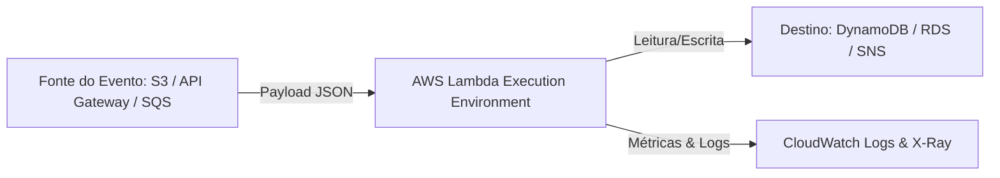
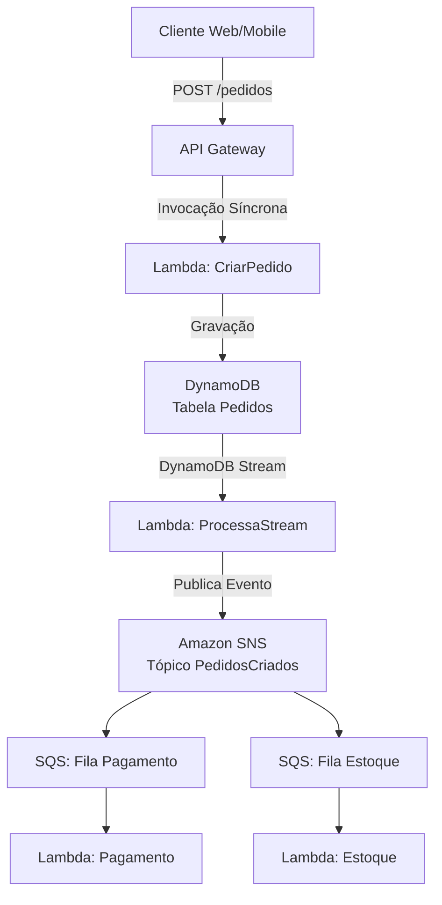

# AWS Lambda

## O que é

O AWS Lambda é um serviço de computação *serverless* orientado a eventos (*event-driven*). Ele permite que você execute código sem provisionar, gerenciar ou aplicar *patches* em servidores. Você fornece apenas o código (em Python, Node.js, Java, Go, C#, Ruby ou um *custom runtime*) e a AWS cuida de toda a infraestrutura, dimensionamento, alta disponibilidade e execução.

> 💡 **Nota de Exame:** Para a AWS, "Serverless" significa: **zero provisionamento de servidores**, **escalabilidade automática**, **pagamento por execução (ao milissegundo)** e **alta disponibilidade embutida por padrão**.

---

## Qual problema resolve

Antes do Lambda, para rodar uma API ou processar um arquivo, você precisava provisionar uma instância EC2, configurar o sistema operacional, instalar dependências, ajustar *Auto Scaling*, configurar *Load Balancers* e pagar pela instância rodando 24/7 — mesmo sem tráfego.

O Lambda resolve:

1. **Ociosidade Paga:** Você paga estritamente pelo tempo de execução em milissegundos.
2. **Complexidade Operacional:** Elimina a gestão de infraestrutura (*Operational Excellence*).
3. **Escala Lenta:** Acompanha picos repentinos de tráfego instantaneamente sem esperar a inicialização de VMs.

---

## Quando utilizar

* **Processamento de Arquivos em Tempo Real:** Executar processamento de imagem/PDF assim que um arquivo é carregado no Amazon S3.
* **APIs Serverless Backend:** Em conjunto com o Amazon API Gateway ou HTTP APIs.
* **Processamento de Streams:** Consumo de dados em tempo real vindos do Amazon DynamoDB Streams ou Amazon Kinesis.
* **Tarefas Agendadas (Cron):** Disparadas via regras de eventos do Amazon EventBridge.

---

## Quando NÃO utilizar

* **Cargas de Trabalho de Longa Duração:** Processamentos que ultrapassam **15 minutos** (limite máximo de execução do Lambda). *Alternativa:* AWS Fargate ou AWS Batch.
* **Aplicações de Alta Performance com Memória/CPU Fixas Mantidas 24/7:** Se a utilização for constante e previsível a 100%, instâncias EC2 Reservadas ou *Savings Plans* no Fargate podem ser mais baratas.
* **Necessidade de Acesso Root ao SO:** *Alternativa:* EC2 ou Containers no ECS/EKS.

---

## Como funciona

O fluxo do Lambda é puramente orientado a eventos:



1. **Invocação:** O evento envia um *payload* JSON para a função.
2. **Inicialização (Init):** A AWS baixa o pacote do seu código, cria um container isolado (Firecracker microVM), inicia a versão do *runtime* e executa o código fora do *handler*.
3. **Execução (Invoke):** O manipulador (`handler`) do seu código executa o processamento do *payload*.
4. **Shutdown:** Se não houver novas requisições, o ambiente é destruído.

---

## Principais componentes

* **Handler:** A função/método no seu código que a AWS chama quando o Lambda é executado.
* **Event Object:** O documento JSON passado na invocação contendo os dados do evento.
* **Context Object:** Objeto que provê informações da execução (tempo restante, nome da função, ARN, limites de memória).
* **Runtime:** O ambiente de linguagem (ex: Node.js 20.x, Python 3.12).
* **Layers:** Arquivos ZIP adicionais contendo bibliotecas, dependências ou rotinas personalizadas compartilhadas entre funções.

---

## Conceitos importantes

### 1. Modelos de Invocação

* **Síncrona (*Synchronous*):** O chamador aguarda a resposta (ex: API Gateway, SDK). Se der erro, o cliente trata a exceção.
* **Assíncrona (*Asynchronous*):** O chamador entrega o evento e recebe um `202 Accepted` imediato (ex: S3, EventBridge). O Lambda gerencia retentativas automaticamente (**2 tentativas extras**).
* **Baseada em Polling/Mapeamento (*Event Source Mapping*):** O Lambda faz o *polling* do serviço chamador (ex: SQS, DynamoDB Streams, Kinesis). O Lambda gerencia o lote (*batch*) e as retentativas.

### 2. Cold Start vs Warm Start

* **Cold Start:** Ocorre na primeira invocação ou na expansão de concorrência. Inclui o download do código, inicialização do *runtime* e código fora do *handler*.
* **Warm Start:** O container de execução já existe e reutiliza o ambiente para processar uma nova requisição, pulando a fase de inicialização.

> 💡 **Nota de Exame:** Para otimizar o *Warm Start*, conectores de banco de dados e inicializações de SDK devem ser declarados **FORA** do método *handler*.

```python
import boto3

# EXECUTADO NO COLD START (Reutilizado entre invocações)
dynamodb = boto3.resource('dynamodb')
table = dynamodb.Table('MinhaTabela')

def lambda_handler(event, context):
    # EXECUTADO EM CADA INVOCAÇÃO
    response = table.get_item(Key={'id': event['id']})
    return response['Item']

```

---

## Segurança

* **Execution Role (IAM):** Todo Lambda **precisa** de uma IAM Role que concede permissões para o que a função pode acessar (ex: `AWSLambdaBasicExecutionRole` para gravar no CloudWatch Logs + permissão `dynamodb:PutItem`).
* **Resource-based Policy:** Define *quem* tem permissão de **invocar** a função Lambda (ex: permitir que o S3 invoque a função).
* **VPC Access:** Por padrão, o Lambda roda em uma VPC gerenciada com acesso à internet pública. Se precisar acessar um RDS na sua VPC privada, o Lambda criará uma **ENI (Elastic Network Interface)** dentro da sua subnet.

> ⚠️ **Atenção:** Colocar um Lambda na VPC **NÃO** dá acesso à internet a ele automaticamente. É necessário configurar um NAT Gateway na VPC para acesso externo.

---

## Performance

* **Alocação de Recurso:** O Lambda é dimensionado **apenas pela Memória** (de 128 MB a 10.240 MB). A CPU, largura de banda de rede e I/O são alocadas **proporcionalmente** à memória escolhida.
* **Provisioned Concurrency:** Aloca previamente ambientes de execução para eliminar completamente o *Cold Start* em rotas críticas.
* **Concurrency Limits:** Limite padrão regional de **1.000 execuções concorrentes** por conta. Pode usar *Reserved Concurrency* para garantir que uma função tenha cota reservada ou para limitar sua escala (ex: não derrubar um banco relacional).

---

## Custos

A cobrança baseia-se em dois fatores principais:

1. **Número de solicitações:** Total de invocações.
2. **Durabilidade e Memória (GB-segundos):** Calculado multiplicando o tempo de execução (em ms) pela quantidade de memória alocada.

### Estratégias de Redução de Custos:

* **Arquitetura ARM64 (AWS Graviton2):** Funções rodando em ARM64 oferecem melhor custo-benefício (até 34% melhor custo-performance que x86).
* Otimizar a memória (às vezes, aumentar a memória reduz o tempo de execução proporcionalmente, resultando em um custo total menor).

---

## Integrações

* **API Gateway / HTTP API:** Ponto de entrada HTTP para APIs serverless.
* **Amazon S3:** Dispara eventos assíncronos no carregamento de objetos.
* **Amazon SQS / SNS:** Desacoplamento de mensageria e processamento em lote.
* **Amazon DynamoDB Streams:** Gatilho para reação a modificações na base NoSQL.
* **AWS X-Ray:** Rastreamento distribuído (*distributed tracing*) ativado por uma simples chave de configuração.

---

## Comparações

| Característica | AWS Lambda | AWS Fargate (ECS/EKS) | Amazon EC2 |
| --- | --- | --- | --- |
| **Tipo de Computação** | Event-driven / Function as a Service | Container as a Service (Serverless) | Virtual Machine (IaaS) |
| **Tempo Máx. Execução** | 15 minutos | Sem limite | Sem limite |
| **Escalabilidade** | Instantânea (sub-segundo) | Minutos (baseada em métricas) | Minutos (Auto Scaling Group) |
| **Manutenção SO** | 100% Gerenciado pela AWS | 100% Gerenciado pela AWS | Responsabilidade do Usuário |
| **Modelo de Cobrança** | Por ms de execução | Por vCPU e Memória/segundo | Por hora/segundo (rodando) |

---

## Pegadinhas da certificação

* 🛑 **Lambda NÃO mantém estado (*Stateless*):** Dados gravados no disco local (`/tmp`) podem sumir a qualquer momento após a execução do ambiente.
* 🛑 **Limite do diretório `/tmp`:** O espaço de armazenamento temporário varia de **512 MB até 10 GB** (pode ser configurado).
* 🛑 **Comportamento em Falhas de Stream:** Em integrações com Kinesis/DynamoDB Streams, um erro na função trava o processamento da *shard* inteira até que a mensagem expire ou o erro seja resolvido, a menos que uma DLQ (*Dead Letter Queue*) ou *Bisect on Function Error* esteja configurado.
* 🛑 **Retentativas Assíncronas:** Invocação assíncrona tenta **3 vezes no total** (1 inicial + 2 retentativas). Se falhar, vai para uma DLQ (SQS/SNS) ou Destinos do Lambda (*Lambda Destinations*).

---

## Questões clássicas

**Questão 1:** *Um desenvolvedor nota que uma função Lambda que consulta um banco de dados RDS está levando muito tempo na inicialização (Cold Start) e estourando o limite de conexões do banco.*

* **Solução:** Mover a criação da conexão com o RDS para **fora do handler** e implementar o **Amazon RDS Proxy** para pooling de conexões.

**Questão 2:** *Uma aplicação precisa processar uploads de imagens no S3 de forma assíncrona. Caso a função Lambda falhe 3 vezes, a mensagem com os detalhes da falha não pode ser perdida.*

* **Solução:** Configurar um **On-Failure Destination** (Destino de Falha) ou uma **Dead Letter Queue (DLQ)** usando Amazon SQS no Lambda.

---

## Cenário real

Uma empresa de e-commerce precisa processar pedidos em picos de vendas como a Black Friday. O checkout gera um evento que precisa validar o pagamento, atualizar o estoque e enviar um e-mail de confirmação.

A arquitetura precisa processar milhares de pedidos por segundo, ser resiliente a falhas e desacoplada.

---

## Fluxo da arquitetura


---

## Resumo executivo

* **Tempo máximo:** 15 minutos de timeout.
* **Dimensionamento:** Apenas por Memória (128 MB a 10 GB). CPU escala junto.
* **Invocação:** Síncrona (espera resposta), Assíncrona (S3/EventBridge - 2 retentativas), Event Source Mapping (SQS/Streams - faz polling).
* **Boas práticas:** Conexões e SDKs inicializados FORA do handler. Use Arm64 para menor custo.
* **Segurança:** Requer IAM Role de execução e Resource Policies para invocação externa.

---

## Flashcards

**Pergunta:** Qual o tempo máximo de execução de uma função Lambda?

**Resposta:** 15 minutos.

---

**Pergunta:** Como você escala os recursos de CPU em uma função Lambda?

**Resposta:** Aumentando a memória alocada (a CPU é dimensionada proporcionalmente à memória).

---

**Pergunta:** Onde você deve colocar a lógica de conexão com o banco de dados no código do Lambda para melhor performance?

**Resposta:** Fora do método `handler` (no escopo de inicialização do arquivo).

---

**Pergunta:** Quantas vezes o Lambda retenta uma invocação ASSÍNCRONA que falhou?

**Resposta:** Retenta 2 vezes adicionais (totalizando 3 tentativas).

---

**Pergunta:** Qual recurso deve ser usado para eliminar o Cold Start em rotas críticas da aplicação?

**Resposta:** *Provisioned Concurrency* (Concorrência Provisionada).

---

## Checklist Final

* [ ] Sei configurar as permissões mínimas no IAM (Execution Role).
* [ ] Sei a diferença entre invocações Síncronas, Assíncronas e Event Source Mapping.
* [ ] Entendo como usar o X-Ray para rastrear chamadas de funções.
* [ ] Sei como conectar o Lambda a uma VPC e permitir saída de rede via NAT Gateway.
* [ ] Conheço o uso de *Lambda Layers* para reuso de código e dependências.

---

## Erros comuns

* ❌ Colocar credenciais de banco hardcoded no código (Correto: usar **AWS Secrets Manager** ou **Systems Manager Parameter Store**).
* ❌ Esquecer de dar acesso ao CloudWatch Logs na IAM Role da função.
* ❌ Inicializar conexões com banco dentro do *handler*, criando milhares de conexões desnecessárias.

---

## Dicas do Exame

* **"Least operational overhead" / "Serverless":** Escolha **AWS Lambda** em vez de EC2 ou ECS.
* **"Decoupled architecture":** Procure combinações com **SQS** ou **EventBridge**.
* **"Cold start reduction":** A resposta correta envolve **Provisioned Concurrency**.
* **"Tracing distributed requests":** A resposta será **AWS X-Ray**.

---

## 20 Conceitos Mais Importantes Estudados

1. **Serverless Computing**
2. **Event-Driven Architecture**
3. **Execution Role (IAM)**
4. **Cold Start vs. Warm Start**
5. **Provisioned Concurrency**
6. **Reserved Concurrency**
7. **Synchronous Invocation**
8. **Asynchronous Invocation**
9. **Event Source Mapping**
10. **Lambda Layers**
11. **Lambda Handlers**
12. **MicroVM / Firecracker**
13. **Dead Letter Queue (DLQ)**
14. **Lambda Destinations**
15. **Stateless Execution**
16. **VPC Networking (ENI)**
17. **AWS X-Ray Integration**
18. **Environment Variables**
19. **Ephemeral Storage (`/tmp`)**
20. **Graviton2 (ARM64) Architecture**


### 1. Amazon DynamoDB

*Por que expande a cobertura da prova?*

O DynamoDB é o banco de dados oficial do ecossistema serverless da AWS. As questões do exame raramente perguntam apenas "o que é NoSQL"; elas cobram **padrões de acesso e eficiência de código**.

* **Domínios cobertos:**
* **Desenvolvimento (32%):** Leitura consistente vs. eventual, `Query` vs. `Scan`, Partition Key vs. Sort Key, cálculo de RCU/WCU e tratamento de exceções de limite de taxa (`ProvisionedThroughputExceededException`) com *Exponential Backoff* e *Jitter*.
* **Segurança (26%):** Criptografia no descanso (*KMS*) e controle de acesso em nível de item utilizando IAM (*Fine-Grained Access Control* com condições como `dynamodb:LeadingKeys`).
* **Otimização (18%):** Uso de Global Secondary Indexes (GSI) e Local Secondary Indexes (LSI), DynamoDB Accelerator (DAX) para cache em memória de sub-milissegundo, e TTL para expiração automática de dados sem custo adicional.


---

### 2. AWS IAM (Identity and Access Management)

*Por que expande a cobertura da prova?*

O IAM atravessa **todas as questões da prova**. Praticamente não existe pergunta no exame em que a resposta final não envolva uma política ou permissão do IAM.

* **Domínios cobertos:**
* **Segurança (26%):** Aprofundamento no algoritmo de avaliação de políticas (Deny explícito > Allow explícito > Deny implícito). Diferença crucial entre **Resource-based Policies** (ex: S3 Bucket Policy, SQS Policy) e **Identity-based Policies**.
* **Desenvolvimento (32%):** Chamadas cross-account via **AWS STS (Security Token Service)** usando `AssumeRole` para gerar credenciais temporárias em vez de criar usuários ou chaves de acesso (*Access Keys*) permanentes no código.
* **Implantação (24%):** Aplicação do princípio de **Menor Privilégio (*Least Privilege*)** e auditoria através do *Policy Simulator*.


---

### 3. Amazon SQS & Amazon SNS (Mensageria e Desacoplamento)

*Por que expande a cobertura da prova?*

O exame exige que o desenvolvedor saiba construir arquiteturas resilientes e desacopladas (*loose coupling*). O padrão **Fan-out** (SNS enviando mensagens para múltiplas filas SQS simultaneamente) cai com extrema frequência.

* **Domínios cobertos:**
* **Desenvolvimento (32%):** Filas Standard vs. FIFO (garantia de ordem e desduplicação de mensagens), tratamento de *Visibility Timeout*, *Short Polling* vs. *Long Polling* (redução de custos e requisições vazias).
* **Otimização e Tolerância a Falhas (18%):** Configuração de **Dead Letter Queues (DLQ)** para mensagens que falham consecutivamente e estratégias de reprocessamento.
* **Segurança (26%):** Criptografia no trânsito/repouso usando KMS integrado às filas e tópicos.


---

### 4. AWS CloudFormation & AWS SAM (Infrastructure as Code)

*Por que expande a cobertura da prova?*

Cobre quase a totalidade do domínio de **Implantação (24%)**. O desenvolvedor AWS não cria recursos clicando no console; ele implanta via código.

* **Domínios cobertos:**
* **Implantação (24%):** Sintaxe de templates YAML/JSON, estrutura de seções (`Parameters`, `Mappings`, `Resources`, `Outputs`), funções intrínsecas (`Ref`, `Fn::GetAtt`, `Fn::ImportValue`, `Fn::Sub`).
* **Políticas de Atualização e Deploy:** `Change Sets`, estratégias de deploy de serverless no SAM integradas com AWS CodeDeploy (Deploy Gradual, *Canary* e *Linear* com rollback automático baseado em alarmes do CloudWatch).
* **Solução de Problemas (18%):** Diagnóstico de falhas de deploy (`ROLLBACK_IN_PROGRESS`, `ROLLBACK_COMPLETE`) e resolução de dependências cíclicas entre stacks.


