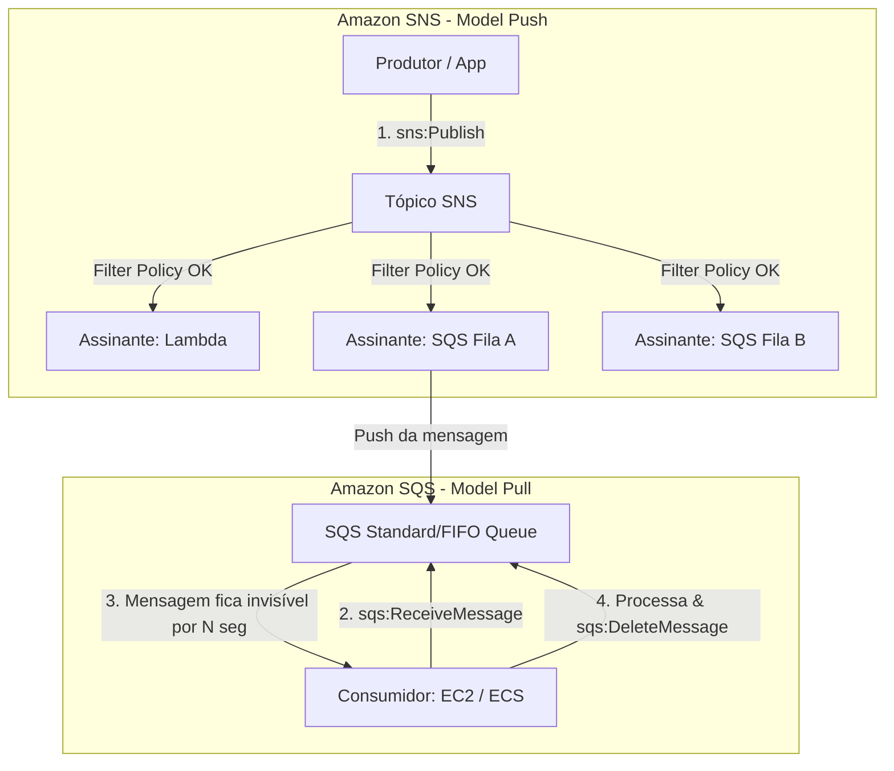
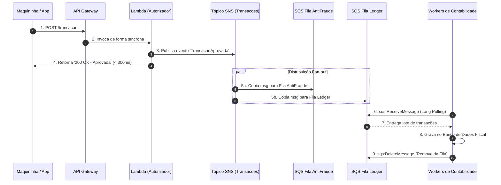

# Amazon SQS & Amazon SNS (Mensageria e Desacoplamento)

## O que é

O **Amazon SQS (Simple Queue Service)** e o **Amazon SNS (Simple Notification Service)** são os dois pilares fundamentais da mensageria gerenciada e arquitetura orientada a eventos (*event-driven architecture*) na AWS.

* **Amazon SQS (Modelo Pull / Point-to-Point):** É uma fila de mensagens gerenciada. O produtor envia a mensagem para a fila, a mensagem fica armazenada de forma altamente disponível e durável, e os consumidores precisam realizar chamadas ativas (*polling*) para buscar, processar e explicitamente deletar a mensagem.
* **Amazon SNS (Modelo Push / Publish-Subscribe):** Esqueça a fila armazenada. O SNS é um barramento de notificações (*pub/sub*). O produtor publica uma mensagem em um **Tópico**, e o SNS se encarrega de empurrar (*push*) essa mensagem em tempo real para múltiplos assinantes simultâneos (filas SQS, funções Lambda, endpoints HTTP/HTTPS, e-mails, SMS, notificações push mobile).

Para um desenvolvedor ou arquiteto cloud-native:

> **SQS é um amortecedor de carga de processamento (*buffer*). SNS é um distribuidor de eventos (*fan-out*).**

---

## Qual problema resolve

### 1. Acoplamento Rígido (*Tight Coupling*)

Em arquiteturas monolíticas ou de microsserviços sem mensageria, o Serviço A chama diretamente a API REST do Serviço B via HTTP síncrono. Se o Serviço B ficar indisponível, falhar ou sofrer picos de tráfego, o Serviço A também falhará ou travará aguardando resposta.

### 2. Perda de Requisições sob Carga Extrema (*Spiky Traffic*)

Se um e-commerce recebe 100.000 pedidos por minuto na Black Friday e seu serviço de processamento de pagamentos suporta apenas 5.000 requisições por minuto, o sistema entra em colapso. O SQS atua como um reservatório (*buffer*), armazenando as mensagens com segurança e permitindo que os consumidores processem o tráfego no seu próprio ritmo (*rate limiting/rate leveling*).

### 3. Duplicação do Esforço de Envio (*Fan-out Challenge*)

Sem o SNS, para notificar 5 sistemas diferentes sobre um evento (ex: "Pedido Criado"), a aplicação precisaria fazer 5 chamadas de rede síncronas sequenciais ou gerenciar *threads* complexas. Com o SNS, a aplicação faz apenas **uma** chamada de publicação para o Tópico, e a AWS entrega a mensagem para todos os inscritos em paralelo.

---

## Quando utilizar

### Quando usar o Amazon SQS:

* **Desacoplamento de componentes assíncronos:** O front-end/API aceita a requisição, coloca o job no SQS e responde 202 Accepted imediatamente ao usuário.
* **Nivelamento de Carga (*Load Leveling*):** Proteger bancos de dados relacionais (RDS) ou APIs de terceiros contra picos massivos de escrita.
* **Processamento Batch / Background:** Enfileiramento de tarefas pesadas (transcodificação de vídeo, geração de relatórios PDF, envio de e-mails em massa).
* **Tratamento de Falhas com DLQ:** Enviar mensagens que falharam repetidamente para uma fila de mensagens mortas (*Dead-Letter Queue*) para análise sem parar a aplicação principal.

### Quando usar o Amazon SNS:

* **Arquiteturas Fan-Out (SNS + SQS):** Enviar uma única mensagem para um tópico e entregar cópias para múltiplas filas SQS independentes (ex: um pedido precisa ir para a fila de faturamento, fila de estoque e fila de fraude simultaneamente).
* **Notificações diretas para humanos:** Envio de SMS, e-mail administrativo ou Notificação Push para aplicativos iOS/Android.
* **Gatilho de Eventos em Escala:** Acionar funções Lambda ou webhooks HTTP de parceiros instantaneamente ao ocorrer um evento na infraestrutura.

---

## Quando NÃO utilizar

* **Comunicação de Baixa Latência Síncrona (Sub-milisegundo Request/Response):** Se a sua aplicação precisa de uma resposta imediata na mesma conexão TCP (ex: checkout interativo do usuário aguardando validação do cartão). *Alternativa:* **Amazon API Gateway + AWS Lambda / gRPC / Application Load Balancer**.
* **Streaming de Dados em Tempo Real com Ordenação Global e Replay:** Se você precisa analisar eventos em tempo real, processar dados de telemetria IoT ou reprocessar dados passados voltando o ponteiro de leitura (*offset*). *Alternativa:* **Amazon Kinesis Data Streams** ou **Amazon MSK (Managed Streaming for Apache Kafka)**.
* **Barramento de Eventos com Dezenas de Regras de Roteamento baseadas em Conteúdo Complexo:** Embora o SNS possua filtros simples, roteamento complexo, schema registry e integração direta com SaaS terceiros (ex: Zendesk, Salesforce) exigem um barramento orientado a eventos enterprise. *Alternativa:* **Amazon EventBridge**.

---

## Como funciona

### Fluxo de Mensageria com SQS e SNS



### O Ciclo Completo da Mensagem no SQS (Ponto Crucial para Prova!)

1. **Envio (*SendMessage*):** O Produtor envia a mensagem para a Fila SQS. A mensagem recebe um `MessageId` e um hash MD5 do conteúdo.
2. **Recepção (*ReceiveMessage*):** O Consumidor faz uma chamada de *Polling* para o SQS. O SQS retorna de 1 a 10 mensagens (limite por chamada).
3. **Timer de Invisibilidade (*Visibility Timeout*):** A partir do momento em que a mensagem é entregue ao consumidor, ela **NÃO é deletada da fila**. Em vez disso, ela entra no período de *Visibility Timeout* (padrão: 30 segundos). Durante esse tempo, a mensagem fica oculta para outros consumidores.
4. **Finalização com Sucesso (*DeleteMessage*):**
* Se o consumidor processar com sucesso, ele faz uma chamada `sqs:DeleteMessage` passando o `ReceiptHandle` (string temporária recebida ao buscar a mensagem). A mensagem é removida definitivamente da fila.


5. **Tratamento de Falha / Expiração do Timeout:**
* Se o consumidor quebrar, travar ou estourar o tempo antes de chamar o `DeleteMessage`, o *Visibility Timeout* expira. A mensagem volta a ficar visível na fila para que outro consumidor possa lê-la e processá-la.


---

## Principais componentes

* **Topic (SNS):** Ponto de acesso lógico ao qual os produtores enviam mensagens. Atua como um canal de comunicação de acesso centralizado.
* **Subscription (SNS):** Configuração que conecta um Tópico a um endpoint de destino (SQS, Lambda, HTTP, Email, SMS).
* **Queue (SQS):** Estrutura de armazenamento persistente (distribuída em múltiplas AZs) que armazena mensagens até que os consumidores as processem.
* **Producer (SQS/SNS):** Aplicação, serviço AWS (ex: S3, CloudWatch Alarms) ou script que cria e publica mensagens.
* **Consumer (SQS):** Aplicação (EC2, ECS, Lambda, On-premises) que busca ativamente mensagens da fila para processamento.
* **Receipt Handle (SQS):** Identificador exclusivo temporário retornado quando uma mensagem é recebida do SQS. É **obrigatório** apresentar o `ReceiptHandle` correto para realizar o `DeleteMessage` ou `ChangeMessageVisibility`.
* **Message Group ID (SQS FIFO):** Tag usada em filas FIFO que garante que mensagens com o mesmo ID de grupo sejam processadas em ordem estrita de entrega por um único consumidor de cada vez.
* **Deduplication ID (SQS FIFO):** Token usado pelo SQS FIFO para identificar e rejeitar mensagens duplicadas enviadas dentro de uma janela de 5 minutos.

---

## Conceitos importantes

### 1. SQS Standard vs. SQS FIFO

Esta tabela é testada exaustivamente em quase todas as provas de certificação AWS.

| Característica | SQS Standard Queue | SQS FIFO Queue |
| --- | --- | --- |
| **Throughput (Vazão)** | **Ilimitado** (Milhões de msgs/seg). | Limitado a **300 msgs/seg** (ou 3.000 msgs/seg com *batching*). |
| **Ordenação** | **Best-Effort Ordering** (A ordem pode mudar sob carga). | **First-In-First-Out Estrito** (Garantia de ordem perfeita por *Message Group ID*). |
| **Entrega** | **At-Least-Once Delivery** (Garante entrega, mas pode duplicar mensagens raramente). | **Exactly-Once Processing** (Sem duplicatas dentro da janela de deduplicação). |
| **Nome da Fila** | Qualquer nome válido. | **OBRIGATÓRIO** terminar com o sufixo `.fifo` (ex: `pedidos.fifo`). |
| **Custo** | Mais barato. | Ligeiramente mais caro por milhão de requisições. |

### 2. Visibility Timeout (SQS)

* Tempo em que uma mensagem permanece oculta na fila enquanto está sendo processada por um consumidor.
* **Faixa:** De 0 segundos a 12 horas (Padrão: 30 segundos).
* **Se o tempo for curto demais:** A mensagem fica visível novamente antes que o consumidor atual termine. Outro consumidor pegará a mesma mensagem, gerando **processamento duplicado**.
* **Se o tempo for longo demais:** Se o consumidor falhar no início, a mensagem ficará retida desnecessariamente na fila por muito tempo até que possa ser reprocessada.
* **Solução dinâmica:** O consumidor pode chamar a API `ChangeMessageVisibility` durante o processamento longo para renovar o "aluguel" da mensagem antes que o tempo expire.

```json
// Exemplo de estender o Visibility Timeout via AWS SDK
{
  "QueueUrl": "https://sqs.us-east-1.amazonaws.com/123456789012/MinhaFila",
  "ReceiptHandle": "Mb3zXDzD4A...",
  "VisibilityTimeout": 120 // Estende por mais 2 minutos
}

```

### 3. Short Polling vs. Long Polling (SQS)

* **Short Polling (`WaitTimeSeconds = 0`):** O SQS consulta uma amostra aleatória de seus servidores armazenadores e retorna imediatamente, mesmo que a fila esteja vazia. Gera muitas respostas vazias (`ReceiveMessageResponse` sem dados), **aumentando o custo com chamadas de API desnecessárias**.
* **Long Polling (`WaitTimeSeconds > 0` - max 20 seg):** O SQS aguarda até que uma mensagem chegue à fila antes de responder à chamada API, ou até que o tempo limite de espera termine.
* 💡 **Boa Prática AWS:** **Sempre configure Long Polling (`WaitTimeSeconds = 20`)**. Reduz os custos drasticamente e diminui a latência de entrega da mensagem para a aplicação.

### 4. Dead-Letter Queue (DLQ)

* É uma fila SQS normal configurada para receber mensagens que falharam ao ser processadas repetidamente por uma fila principal (ou por uma chamada do SNS/Lambda).
* **MaxReceiveCount:** Define quantas vezes o consumidor tenta processar uma mensagem (ex: 5 vezes). Se na 6ª tentativa a mensagem ainda não for deletada com sucesso, o SQS move automaticamente a mensagem para a DLQ.
* **DLQ Redrive (SQS DLQ Redrive):** Recurso nativo no console/API da AWS que permite inspecionar mensagens da DLQ e movê-las de volta para a fila original para reprocessamento após a correção de um bug no código.

### 5. SNS Message Filtering & Fan-Out Architectures

* Por padrão, todos os assinantes de um Tópico SNS recebem 100% das mensagens publicadas.
* Com o **SNS Message Filtering**, você define uma política JSON (*Filter Policy*) na assinatura do Tópico. O SNS avalia os atributos da mensagem (*Message Attributes*) e **só entrega a mensagem ao destino se ela atender aos critérios especificados**. Isso economiza processamento e custos no consumidor.

```json
// Exemplo de SNS Filter Policy configurada na assinatura da fila SQS de Fraudes
{
  "tipo_transacao": ["INTERNACIONAL", "SUSPEITA"],
  "valor": [{ "numeric": [">=", 10000] }]
}

```

---

## Segurança

* **IAM Policies (Identity-Based):** Definem quais usuários, roles ou funções Lambda têm permissão para executar chamadas de API no SQS/SNS (ex: `sqs:SendMessage`, `sqs:ReceiveMessage`, `sns:Publish`).
* **SQS Access Policies / SNS Topic Policies (Resource-Based):** Anexadas diretamente à fila SQS ou Tópico SNS. **Indispensáveis para cenários Cross-Account ou para autorizar que outros serviços AWS (S3, SNS, EventBridge) consigam escrever na fila SQS**.

> ⚠️ **Ponto de Atenção na Prova:** Para que um Tópico SNS consiga entregar mensagens em uma fila SQS, a **SQS Policy** da fila precisa dar um `Allow` explícito na ação `sqs:SendMessage` com a condição `aws:SourceArn` apontando para o ARN do Tópico SNS.

```json
// Política de Recursos (Queue Policy) anexada ao SQS para permitir recebimento do SNS
{
  "Version": "2012-10-17",
  "Statement": [
    {
      "Sid": "PermitirSNSFanOut",
      "Effect": "Allow",
      "Principal": "*",
      "Action": "sqs:SendMessage",
      "Resource": "arn:aws:sqs:us-east-1:123456789012:MinhaFilaSQS",
      "Condition": {
        "ArnEquals": {
          "aws:SourceArn": "arn:aws:sns:us-east-1:123456789012:MeuTopicoSNS"
        }
      }
    }
  ]
}

```

* **Criptografia em Repouso (SSE - Server-Side Encryption):**
* SQS e SNS suportam criptografia em repouso integrada com o **AWS KMS**.
* É possível utilizar chaves gerenciadas pela AWS (`aws/sqs`, `aws/sns`) ou chaves gerenciadas pelo cliente (KMS CMK).


* **Criptografia em Trânsito:** Todo tráfego trafega via chamadas HTTPS autenticadas (TLS 1.2/1.3).
* **VPC Endpoints (AWS PrivateLink):** Permite que recursos dentro de sub-redes privadas em uma VPC publiquem e consumam dados do SQS e SNS sem expor o tráfego à internet pública.

---

## Performance

* **Escalabilidade:** SQS e SNS são serviços serverless massivamente distribuídos. Escalabilidade praticamente ilimitada em filas Standard.
* **Message Size Limit (Tamanho da Mensagem):**
* **SQS e SNS possuem limite estrito de 256 KB por mensagem.**
* *O que fazer se a mensagem tiver 5 MB ou mais?* Utilize o **Amazon SQS Extended Client Library for Java** (ou padrão equivalente): A aplicação faz o upload do payload grande (ex: 10 MB) para um bucket do **Amazon S3**, envia um ponteiro (referência do ARN do S3) na mensagem do SQS com 2 KB, e o consumidor baixa o arquivo diretamente do S3 ao ler a mensagem da fila.


* **Batching (Agrupamento):**
* As APIs `SendMessageBatch`, `ReceiveMessageBatch` e `DeleteMessageBatch` do SQS permitem enviar, receber ou deletar até **10 mensagens (máximo de 256 KB somados no batch)** por chamada API. Isso reduz os custos em até 90% e aumenta drasticamente a vazão.


* **SQS Message Retention Period (Retenção):**
* As mensagens podem permanecer na fila de **1 minuto a 14 dias** (Padrão: **4 dias**). Se não forem processadas e deletadas nesse intervalo, a AWS as apaga definitivamente.


---

## Custos

* **Amazon SQS:**
* Cobrado por **Número de Requisições de API** efetuadas (onde 1 requisição = até 64 KB de dados).
* Tipo de requisições: `SendMessage`, `ReceiveMessage`, `DeleteMessage`.
* **Armadilha de Custo:** Fazer Short Polling continuo com requisições vazias sem parar gera milhões de chamadas faturadas na sua conta.
* *Estratégia de Redução de Custo:* Usar **Long Polling (`WaitTimeSeconds = 20`)** e fazer chamadas em **Batch (Lote)**.


* **Amazon SNS:**
* Cobrado por **Número de Publicações** + **Transferência de dados para fora (Data Transfer Out)** + **Tipo de Assinante**:
* Entregas para SQS/Lambda/HTTP possuem um custo baixo por milhão.
* Entregas para **SMS** e **E-mail** são substancialmente mais caras (principalmente SMS global).


---

## Integrações

* **AWS Lambda + SQS:** A AWS gerencia o polling de forma nativa. O serviço Lambda realiza o polling da fila SQS, agrupa mensagens em lotes (*Batch Size*) e invoca a função de forma síncrona. Se a função Lambda falhar, a mensagem retorna à fila.
* **AWS Lambda + SNS:** O SNS invoca a função Lambda de forma **assíncrona**. Se a função falhar, o próprio SNS faz retentativas automáticas (*Retry Policy*).
* **Amazon S3 + SNS/SQS:** Notificações de eventos no S3 (ex: `s3:ObjectCreated:*`) podem publicar mensagens diretamente em um Tópico SNS ou Fila SQS sem necessitar de código intermediário.
* **Amazon Auto Scaling + SQS:** Escalar instâncias EC2 ou tarefas ECS com base na métrica personalizada `BacklogPerInstance` (Tamanho da Fila / Número de Instâncias ativas), em vez de apenas utilização de CPU.
* **AWS EventBridge + SNS/SQS:** EventBridge pode direcionar regras de eventos enterprise para tópicos SNS ou filas SQS.

---

## Comparações

| Característica | Amazon SQS | Amazon SNS | Amazon Kinesis Data Streams | Amazon EventBridge |
| --- | --- | --- | --- | --- |
| **Modelo** | **Pull** (Polling por consumidores). | **Push** (Pub/Sub instantâneo). | **Pull / Push** (Stream de sharded log). | **Push** (Event Bus com roteamento). |
| **Retenção de Dados** | Até 14 dias (Mensagens ocultas ao processar). | **Zero** (Se não houver assinante, a mensagem é perdida). | De 1 a 365 dias (Replay de dados). | Zero (Pode habilitar Archive/Replay opcional). |
| **Múltiplos Consumidores** | Cada consumidor "consome" e deleta uma fatia. | Todos os assinantes recebem uma **cópia** inteira. | Múltiplas aplicações leem os mesmos cacos (*Shards*). | Múltiplas regras roteiam para múltiplos destinos. |
| **Casos de Uso Principais** | Buffering, rate-limiting, tarefas background. | Fan-out, alertas push, SMS/Email. | Big Data streaming, logs, analytics real-time. | Microsserviços SaaS, automação DevOps cloud. |

---

## Pegadinhas da certificação

* 🛑 **SNS NÃO ARMAZENA MENSAGENS:** O SNS é estritamente um serviço de trânsito em tempo real (*pass-through*). Se você publicar em um Tópico SNS sem assinantes, **a mensagem é descartada para sempre**. Se você precisa de persistência, assine uma fila SQS no Tópico SNS.
* 🛑 **SNS + SQS Fan-Out Cross-Account:** Para criar uma arquitetura Fan-Out onde o Tópico SNS da Conta A entrega mensagens na Fila SQS da Conta B, você deve atualizar a **Resource Policy da fila SQS na Conta B** para aceitar a chamada `sqs:SendMessage` vinda do ARN do Tópico da Conta A.
* 🛑 **Mensagens com mais de 256 KB:** A resposta correta em questões de arquitetura para gerenciar payloads maiores que 256 KB no SQS/SNS é o uso do **S3 Extended Client Library** (armazenar o corpo do arquivo no S3 e enviar a referência de URL/ARN pela fila).
* 🛑 **Diferença de acionamento Lambda (SQS vs SNS):**
* SQS aciona o Lambda via **Event Source Mapping** (O serviço da AWS faz polling no SQS e chama o Lambda de forma **Síncrona**).
* SNS aciona o Lambda de forma **Assíncrona**.


* 🛑 **Garantia de Ordem em SQS Standard:** Se a questão mencionar "as mensagens precisam ser processadas obrigatoriamente em ordem de chegada sem duplicatas", a Fila Standard está **ERRADA**. A única escolha correta é a **SQS FIFO**.
* 🛑 **Visibility Timeout Expirando Cedo:** Se a questão diz "a mesma mensagem está sendo processada por múltiplos workers ao mesmo tempo em uma Fila Standard", a causa raiz é que o tempo de processamento do worker é maior que o **Visibility Timeout** configurado.

---

## Questões clássicas

**Questão 1:** *Uma empresa de comércio eletrônico tem uma aplicação web na AWS que processa ordens de compra. A aplicação envia as ordens diretamente para um banco de dados RDS PostgreSQL. Durante promoções relâmpago, o banco de dados atinge 100% de CPU e começa a rejeitar conexões, fazendo com que pedidos de clientes sejam perdidos. Qual arquitetura resolve esse problema com o menor esforço operacional?*

* **A)** Criar um cluster Auto Scaling de instâncias EC2 para processar os pedidos mais rápido.
* **B)** Inserir uma fila Amazon SQS entre a aplicação web e o serviço de processamento, ajustando os workers para ler da fila e gravar no RDS.
* **C)** Migrar o banco de dados para o DynamoDB.
* **D)** Colocar um Tópico Amazon SNS entre a aplicação e o banco de dados.
* **Raciocínio:** A resposta correta é a **B**. O SQS atua como um *buffer* de nivelamento de carga (*load leveling*). A aplicação aceita os pedidos rapidamente e os coloca no SQS sem sobrecarregar o banco. Os *workers* de escrita leem as mensagens do SQS no ritmo suportado pelo RDS, garantindo zero perda de dados sem a complexidade de alterar o motor do banco de dados.

**Questão 2:** *Uma solução financeira precisa processar atualizações de mercado. Vários microsserviços precisam receber a mesma atualização de preço em tempo real: o serviço de Analytics, o serviço de Alertas e o serviço de Auditoria. O volume de dados pode atingir picos imprevistos, e o serviço de Auditoria é mais lento que os demais. Como projetar essa arquitetura?*

* **A)** Fazer a aplicação publicar as atualizações diretamente no serviço de Analytics, Alerta e Auditoria via HTTP.
* **B)** Criar uma Fila SQS e fazer com que todos os três serviços consumam as mensagens da mesma fila.
* **C)** Criar um Tópico SNS onde os eventos são publicados. Criar três Filas SQS (uma para cada microsserviço) e inscrever as três filas no Tópico SNS.
* **D)** Criar três Tópicos SNS diferentes e fazer a aplicação publicar nos três tópicos.
* **Raciocínio:** A resposta correta é a **C**. Este é o padrão arquitetural clássico de **Fan-out (SNS + SQS)**. O SNS distribui as cópias das mensagens para cada fila SQS independente. Como cada serviço tem sua própria fila SQS, o serviço de Auditoria ser mais lento não afetará nem travará os serviços de Analytics ou Alertas.

---

## Cenário real

Uma empresa de meios de pagamento (Fintech) precisa processar transações financeiras enviadas por maquininhas de cartão.

### Requisitos do Sistema:

1. **Disponibilidade e Resiliência:** A aprovação da transação deve responder ao terminal em menos de 1 segundo.
2. **Processamento Pós-Aprovação:** Após aprovada, a transação deve disparar simultaneamente 3 ações assíncronas:
* **Serviço de Anti-Fraude:** Analisa a transação (baixa latência).
* **Serviço de Notificação via Push/SMS:** Informa o dono do cartão no celular.
* **Serviço de Ledger / Contabilidade:** Registra a transação no banco de dados fiscal (processamento mais lento).


3. Nenhuma transação pode ser perdida se o sistema de Ledger cair para manutenção.

### Arquitetura Proposta:

* A API Gateway recebe a requisição e aciona uma Lambda de **Autorização Rápida**.
* A Lambda grava o status "Aprovado" na base e publica o evento `TransacaoAprovada` em um **Tópico SNS**.
* O Tópico SNS possui 3 assinaturas Fan-out para 3 filas **SQS separadas**:
1. `Fila-AntiFraude` (Consumida por Lambda)
2. `Fila-Notificacoes` (Consumida por ECS Container)
3. `Fila-Ledger` (Consumida por workers EC2)


* A `Fila-Ledger` possui uma **Dead-Letter Queue (DLQ)** associada. Se a base de contabilidade ficar fora do ar por horas, as mensagens ficam retidas e protegidas na fila SQS. Se estourarem 5 tentativas de erro, vão para a DLQ para análise posterior, sem afetar as notificações ou o anti-fraude.

---

## Fluxo da arquitetura



---

## Resumo executivo

* **SQS (Pull):** Fila de mensagens persistente para armazenamento temporário, desacoplamento e nivelamento de carga. O consumidor busca e deleta a mensagem explicitamente.
* **SNS (Push):** Serviço de mensageria Pub/Sub. Envia uma única mensagem para múltiplos assinantes simultâneos (Fan-out). Não armazena dados!
* **SQS Standard:** Altíssima vazão (ilimitada), entrega *At-Least-Once*, ordem *Best-Effort*.
* **SQS FIFO:** Ordem estrita (FIFO), entrega *Exactly-Once*, nomes terminados em `.fifo`, limite de vazão menor (300 a 3000 msgs/seg).
* **Visibility Timeout:** Tempo em que a mensagem fica invisível na fila para evitar que outros consumidores a peguem. Se o código do worker demorar, use `ChangeMessageVisibility`.
* **Long Polling (`WaitTimeSeconds = 20`):** Reduz o custo com chamadas de API vazias e reduz a latência na captura de dados.
* **Tamanho de Payload:** Limite estrito de **256 KB** tanto no SQS quanto no SNS. Para arquivos maiores, use o **S3 Extended Client Library**.
* **Arquitetura Fan-Out:** Padrão arquitetural que combina **SNS + Múltiplas Filas SQS** para distribuir mensagens em paralelo para sistemas independentes.

---

## Flashcards

**Pergunta:** Qual é a principal diferença de modelo de entrega entre o Amazon SQS e o Amazon SNS?

**Resposta:** O SQS utiliza o modelo **Pull** (o consumidor busca e remove a mensagem da fila), enquanto o SNS utiliza o modelo **Push** (o serviço entrega a mensagem instantaneamente para todos os assinantes).

---

**Pergunta:** O que acontece se uma mensagem enviada para um Tópico SNS não possuir nenhum assinante cadastrado no momento do envio?

**Resposta:** A mensagem é permanentemente **descartada** e perdida, pois o SNS não armazena mensagens.

---

**Pergunta:** Qual é a função do Visibility Timeout no Amazon SQS?

**Resposta:** Impedir temporariamente que outros consumidores leiam e processem a mesma mensagem enquanto um consumidor atual a está processando.

---

**Pergunta:** Como um consumidor de uma fila SQS deve agir caso precise de mais tempo do que o estipulado no Visibility Timeout para processar uma mensagem pesada?

**Resposta:** O consumidor deve chamar a API `ChangeMessageVisibility` para estender o tempo de invisibilidade antes que o timeout atual expire.

---

**Pergunta:** Qual é a vantagem técnica e financeira de utilizar Long Polling no Amazon SQS?

**Resposta:** O Long Polling espera até 20 segundos por uma mensagem antes de responder à API, eliminando respostas vazias, reduzindo drasticamente os custos com requisições e diminuindo a latência.

---

**Pergunta:** Qual é o limite de tamanho de payload para uma mensagem no SQS e no SNS, e qual a solução recomendada para payloads maiores?

**Resposta:** O limite é de **256 KB**. Para payloads maiores, deve-se usar o **Amazon S3 Extended Client Library** (armazenando o payload no S3 e enviando a referência do objeto na mensagem).

---

**Pergunta:** Em uma fila SQS FIFO, o que é o `Message Group ID`?

**Resposta:** É a tag que identifica que um grupo de mensagens pertence ao mesmo contexto, garantindo que as mensagens desse grupo específico sejam processadas estritamente em ordem de chegada.

---

**Pergunta:** O que deve ser configurado na SQS Queue Policy para permitir que um Tópico SNS localizado em outra conta envie mensagens para essa fila?

**Resposta:** Uma declaração de permissão dando `Allow` na ação `sqs:SendMessage`, definindo o Tópico SNS como o `Principal` (ou usando a condição `aws:SourceArn`).

---

**Pergunta:** O que é o parâmetro `MaxReceiveCount` na configuração de uma Dead-Letter Queue (DLQ) do SQS?

**Resposta:** É o número máximo de vezes que uma mensagem pode ser lida e falhar ao ser processada antes de ser movida automaticamente pelo SQS para a DLQ.

---

**Pergunta:** Qual recurso do SNS permite que um assinante receba apenas um subconjunto específico das mensagens publicadas em um Tópico?

**Resposta:** **SNS Message Filtering** (utilizando uma *Filter Policy* em formato JSON configurada na assinatura).

---

## Checklist Final

* [ ] Sei exatamente quando escolher **SQS Standard vs. SQS FIFO**.
* [ ] Entendo como o **Visibility Timeout** funciona e como evitar mensagens duplicadas.
* [ ] Sei aplicar a combinação **SNS + SQS (Fan-Out Pattern)** em arquitetura cloud.
* [ ] Conheço a diferença e os benefícios entre **Short Polling** e **Long Polling (`WaitTimeSeconds = 20`)**.
* [ ] Sei como tratar mensagens grandes (> 256 KB) utilizando o **Amazon S3**.
* [ ] Compreendo a função e o ciclo de vida de uma **Dead-Letter Queue (DLQ)**.
* [ ] Sei como conceder permissões em filas SQS usando **Resource Policies** para integrações com SNS/S3.

---

## Erros comuns

* ❌ Esquecer de chamar explicitamente a API `sqs:DeleteMessage` após processar uma mensagem no SQS (a mensagem volta para a fila após o Visibility Timeout).
* ❌ Tentar usar o SNS como um local para armazenar mensagens pendentes para processamento posterior em lote.
* ❌ Acreditar que uma Fila SQS Standard garante a entrega das mensagens exatamente na ordem em que foram enviadas.
* ❌ Definir o Visibility Timeout do SQS com valor menor do que o tempo máximo de execução da sua função Lambda ou worker de backend.

---

## Dicas do Exame

* **"Decouple components / Buffer incoming traffic":** Pense imediatamente em **Amazon SQS**.
* **"Fan-out / Publish once to multiple subscribers":** Pense imediatamente na combinação **Amazon SNS + Amazon SQS**.
* **"Messages must be processed strictly in order / No duplicates":** A única escolha correta é **SQS FIFO**.
* **"Reduce API costs / Eliminate empty responses":** A solução é ativar o **Long Polling (`WaitTimeSeconds > 0`)**.
* **"Handle message processing failures without blocking the queue":** A resposta é configurar uma **Dead-Letter Queue (DLQ)**.

---

## 20 Conceitos Mais Importantes Estudados

1. **Amazon SQS (Pull / Buffer Model)**
2. **Amazon SNS (Push / Pub-Sub Model)**
3. **Padrão Arquitetural Fan-Out (SNS + SQS)**
4. **SQS Standard Queue (Unbounded Throughput / Best-effort ordering)**
5. **SQS FIFO Queue (Exactly-once / Strictly ordered / `.fifo` suffix)**
6. **Visibility Timeout & `ChangeMessageVisibility**`
7. **`ReceiptHandle` (Necessário para a ação `DeleteMessage`)**
8. **Long Polling vs. Short Polling (`WaitTimeSeconds`)**
9. **Dead-Letter Queue (DLQ) & `MaxReceiveCount**`
10. **DLQ Redrive**
11. **Limite de Payload de 256 KB**
12. **S3 Extended Client Library**
13. **SNS Message Filtering Policy**
14. **SQS / SNS Resource-Based Policies (Access Policies)**
15. **Message Group ID (Garantia de ordem por grupo no SQS FIFO)**
16. **Deduplication ID & Content-Based Deduplication (SQS FIFO)**
17. **Criptografia SSE com AWS KMS**
18. **Integração SQS com AWS Lambda Event Source Mapping**
19. **Nivelamento de Carga (*Load Leveling / Rate Matching*)**
20. **Batching de Mensagens (`SendMessageBatch`)**